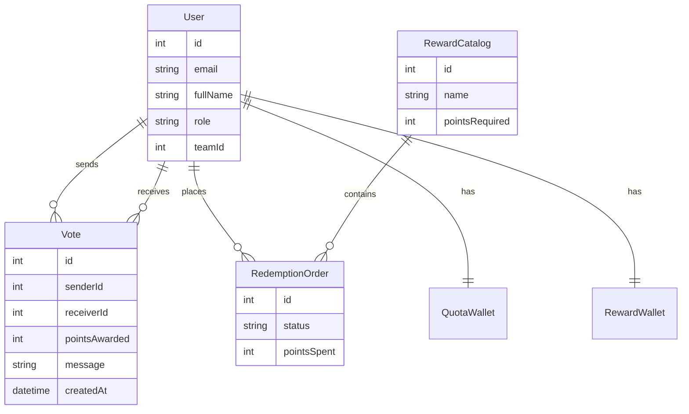
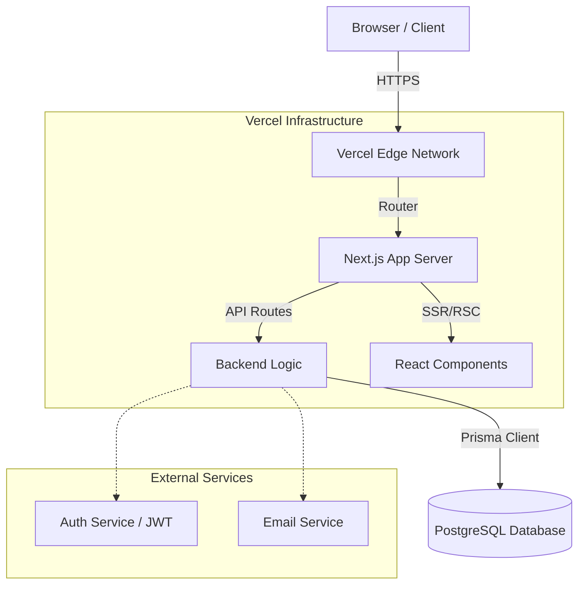
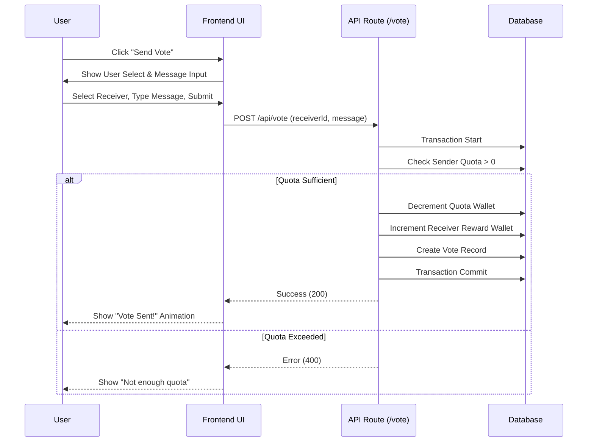

# System Diagrams

## 1. Entity Relationship Diagram (ERD)
Based on current prisma schema.

```mermaid
erDiagram
    User ||--o{ Vote : sends
    User ||--o{ Vote : receives
    User ||--o{ RedemptionOrder : places
    User ||--|| QuotaWallet : has
    User ||--|| RewardWallet : has
    
    Vote {
        int id
        int senderId
        int receiverId
        int pointsAwarded
        string message
        datetime createdAt
    }

    User {
        int id
        string email
        string fullName
        string role
        int teamId
    }

    RewardCatalog ||--o{ RedemptionOrder : contains
    RewardCatalog {
        int id
        string name
        int pointsRequired
    }

    RedemptionOrder {
        int id
        string status
        int pointsSpent
    }
```

## 2. System Architecture

```mermaid
graph TD
    Client[Browser / Client] -->|HTTPS| Vercel[Vercel Edge Network]
    
    subgraph "Vercel Infrastructure"
        Vercel -->|Router| NextApp[Next.js App Server]
        NextApp -->|API Routes| API[Backend Logic]
        NextApp -->|SSR/RSC| Pages[React Components]
    end
    
    API -->|Prisma Client| DB[(PostgreSQL Database)]
    
    subgraph "External Services"
        Auth[Auth Service / JWT]
        Mail[Email Service]
    end
    
    API -.-> Auth
    API -.-> Mail
```

## 3. Core User Flow: Sending a Vote

```mermaid
sequenceDiagram
    participant U as User
    participant FE as Frontend UI
    participant API as API Route (/vote)
    participant DB as Database

    U->>FE: Click "Send Vote"
    FE->>U: Show User Select & Message Input
    U->>FE: Select Receiver, Type Message, Submit
    FE->>API: POST /api/vote (receiverId, message)
    
    API->>DB: Transaction Start
    API->>DB: Check Sender Quota > 0
    alt Quota Sufficient
        API->>DB: Decrement Quota Wallet
        API->>DB: Increment Receiver Reward Wallet
        API->>DB: Create Vote Record
        API->>DB: Transaction Commit
        API-->>FE: Success (200)
        FE-->>U: Show "Vote Sent!" Animation
    else Quota Exceeded
        API-->>FE: Error (400)
        FE-->>U: Show "Not enough quota"
    end
```
