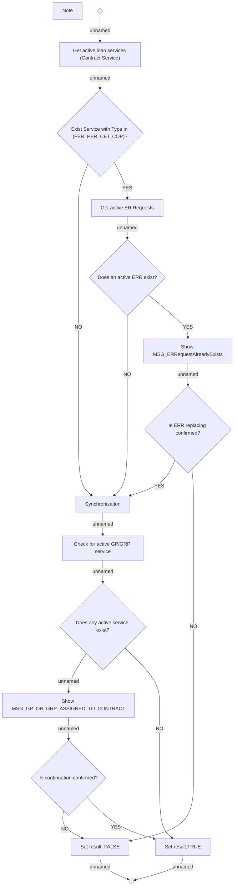

# Check concurrent active loan services - Activity

- **Diagram Type**: Activity
- **Package**: HomerSelect/BSL/Analysis Model/Contract Management/Loan Service Processing/COMMON for Loan Services/Business Rules
- **Diagram ID**: 159633
- **Elements**: 16
- **Connectors**: 19

