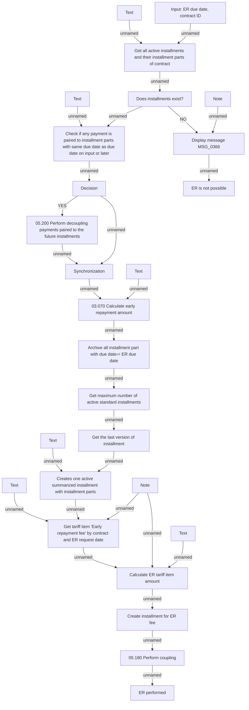

# 03.110 Perform early repayment installment schedule

```mermaid
graph TD
    el_1876324["Note"]
    el_1876310["Note"]
    el_1876327["Text"]
    el_1876317["Text"]
    el_1876315["Text"]
    el_1876314["Text"]
    el_1876318["Text"]
    el_1876308["Text"]
    ER_performed["ER performed"]
    Create_installment_for_ER_fee["Create installment for ER fee"]
    n_05_180_Perform_coupling["05.180 Perform coupling"]
    Calculate_ER_tariff_item_amount["Calculate ER tariff item amount"]
    Get_tariff_item_Early_repayment_fee_by_contract_and_ER_reque["Get tariff item 'Early repayment fee' by contract and ER request date"]
    Creates_one_active_summarized_installment_with_installment_p["Creates one active summarized installment with installment parts"]
    Get_the_last_version_of_installment["Get the last version of installment"]
    Get_maximum_number_of_active_standard_installments["Get maximum number of active standard installments"]
    Archive_all_installment_part_with_due_date_ER_due_date["Archive all installment part with due date›= ER due date"]
    el_1876339["Synchronization"]
    n_03_070_Calculate_early_repayment_amount["03.070 Calculate early repayment amount"]
    n_05_200_Perform_decoupling_payments_paired_to_the_future_in["05.200 Perform decoupling payments paired to the future installments"]
    el_1876338["Decision"]
    Check_if_any_payment_is_paired_to_installment_parts_with_sam["Check if any payment is paired to installment parts with same due date as due date on input or later "]
    ER_is_not_possible["ER is not possible"]
    Display_message_MSG_0366["Display message MSG_0366"]
    Does_installments_exist["Does installments exist?"]
    Get_all_active_installments_and_their_installment_parts_of_c["Get all active installments and their installment parts of contract "]
    Input_ER_due_date_contract_ID["Input: ER due date, contract ID"]
    n_05_200_Perform_decoupling_payments_paired_to_the_future_in -->|unnamed| el_1876339
    Calculate_ER_tariff_item_amount -->|unnamed| Create_installment_for_ER_fee
    Create_installment_for_ER_fee -->|unnamed| n_05_180_Perform_coupling
    Get_tariff_item_Early_repayment_fee_by_contract_and_ER_reque -->|unnamed| Calculate_ER_tariff_item_amount
    el_1876324 -->|unnamed| Calculate_ER_tariff_item_amount
    el_1876314 -->|unnamed| Calculate_ER_tariff_item_amount
    el_1876318 -->|unnamed| Get_tariff_item_Early_repayment_fee_by_contract_and_ER_reque
    Creates_one_active_summarized_installment_with_installment_p -->|unnamed| Get_tariff_item_Early_repayment_fee_by_contract_and_ER_reque
    el_1876324 -->|unnamed| Get_tariff_item_Early_repayment_fee_by_contract_and_ER_reque
    el_1876308 -->|unnamed| Creates_one_active_summarized_installment_with_installment_p
    Get_the_last_version_of_installment -->|unnamed| Creates_one_active_summarized_installment_with_installment_p
    Get_maximum_number_of_active_standard_installments -->|unnamed| Get_the_last_version_of_installment
    n_05_180_Perform_coupling -->|unnamed| ER_performed
    n_03_070_Calculate_early_repayment_amount -->|unnamed| Archive_all_installment_part_with_due_date_ER_due_date
    el_1876315 -->|unnamed| Get_all_active_installments_and_their_installment_parts_of_c
    el_1876338 -->|unnamed| el_1876339
    el_1876339 -->|unnamed| n_03_070_Calculate_early_repayment_amount
    el_1876327 -->|unnamed| n_03_070_Calculate_early_repayment_amount
    el_1876338 -->|YES| n_05_200_Perform_decoupling_payments_paired_to_the_future_in
    Check_if_any_payment_is_paired_to_installment_parts_with_sam -->|unnamed| el_1876338
    el_1876317 -->|unnamed| Check_if_any_payment_is_paired_to_installment_parts_with_sam
    Does_installments_exist -->|unnamed| Check_if_any_payment_is_paired_to_installment_parts_with_sam
    Display_message_MSG_0366 -->|unnamed| ER_is_not_possible
    Does_installments_exist -->|NO| Display_message_MSG_0366
    el_1876310 -->|unnamed| Display_message_MSG_0366
    Get_all_active_installments_and_their_installment_parts_of_c -->|unnamed| Does_installments_exist
    Input_ER_due_date_contract_ID -->|unnamed| Get_all_active_installments_and_their_installment_parts_of_c
    Archive_all_installment_part_with_due_date_ER_due_date -->|unnamed| Get_maximum_number_of_active_standard_installments
```
