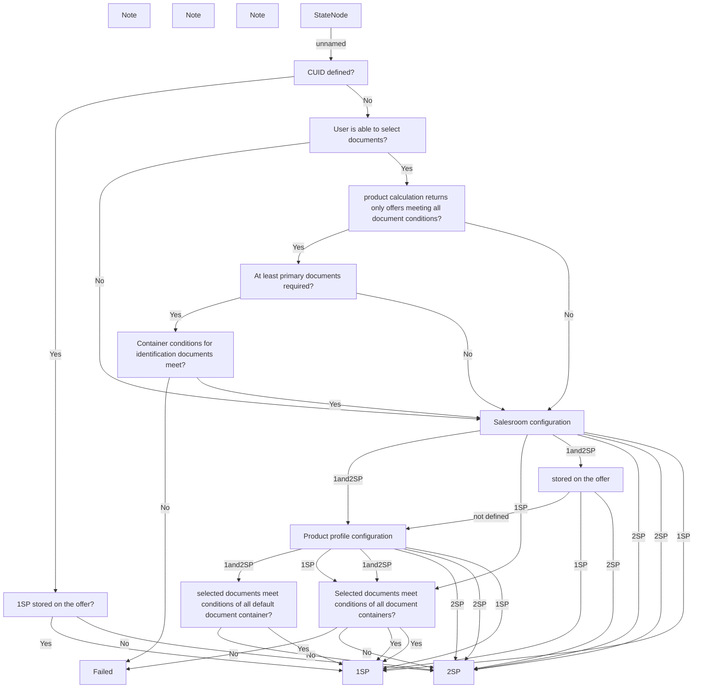

# Decision of 1SP or 2SP

```mermaid
graph TD
    n_1SP_stored_on_the_offer["1SP stored on the offer?"]
    stored_on_the_offer["stored on the offer"]
    el_1878461["Note"]
    el_1878462["Note"]
    el_1878463["Note"]
    Selected_documents_meet_conditions_of_all_document_container["Selected documents meet conditions of all document containers?"]
    Product_profile_configuration["Product profile configuration"]
    Selected_documents_meet_conditions_of_all_document_container["Selected documents meet conditions of all document containers?"]
    Container_conditions_for_identification_documents_meet["Container conditions for identification documents meet?"]
    Failed["Failed"]
    Salesroom_configuration["Salesroom configuration"]
    At_least_primary_documents_required["At least primary documents required?"]
    product_calculation_returns_only_offers_meeting_all_document["product calculation returns only offers meeting all document conditions?"]
    selected_documents_meet_conditions_of_all_default_document_c["selected documents meet conditions of all default document container?"]
    Product_profile_configuration["Product profile configuration"]
    Salesroom_configuration["Salesroom configuration"]
    User_is_able_to_select_documents["User is able to select documents?"]
    n_1SP["1SP"]
    n_2SP["2SP"]
    CUID_defined["CUID defined?"]
    el_1878470["StateNode"]
    Container_conditions_for_identification_documents_meet -->|No| Failed
    CUID_defined -->|Yes| n_1SP_stored_on_the_offer
    User_is_able_to_select_documents -->|No| Salesroom_configuration
    Salesroom_configuration -->|1and2SP| Product_profile_configuration
    Product_profile_configuration -->|1and2SP| selected_documents_meet_conditions_of_all_default_document_c
    User_is_able_to_select_documents -->|Yes| product_calculation_returns_only_offers_meeting_all_document
    product_calculation_returns_only_offers_meeting_all_document -->|Yes| At_least_primary_documents_required
    product_calculation_returns_only_offers_meeting_all_document -->|No| Salesroom_configuration
    Selected_documents_meet_conditions_of_all_document_container -->|No| Failed
    CUID_defined -->|No| User_is_able_to_select_documents
    At_least_primary_documents_required -->|Yes| Container_conditions_for_identification_documents_meet
    Salesroom_configuration -->|1SP| Selected_documents_meet_conditions_of_all_document_container
    Product_profile_configuration -->|1SP| Selected_documents_meet_conditions_of_all_document_container
    stored_on_the_offer -->|not defined| Product_profile_configuration
    Product_profile_configuration -->|1and2SP| Selected_documents_meet_conditions_of_all_document_container
    Salesroom_configuration -->|1and2SP| stored_on_the_offer
    Container_conditions_for_identification_documents_meet -->|Yes| Salesroom_configuration
    stored_on_the_offer -->|1SP| n_1SP
    Salesroom_configuration -->|2SP| n_2SP
    Product_profile_configuration -->|2SP| n_2SP
    Selected_documents_meet_conditions_of_all_document_container -->|No| n_2SP
    Product_profile_configuration -->|2SP| n_2SP
    Salesroom_configuration -->|2SP| n_2SP
    stored_on_the_offer -->|2SP| n_2SP
    At_least_primary_documents_required -->|No| Salesroom_configuration
    selected_documents_meet_conditions_of_all_default_document_c -->|No| n_2SP
    el_1878470 -->|unnamed| CUID_defined
    Selected_documents_meet_conditions_of_all_document_container -->|Yes| n_1SP
    Salesroom_configuration -->|1SP| n_1SP
    Product_profile_configuration -->|1SP| n_1SP
    selected_documents_meet_conditions_of_all_default_document_c -->|Yes| n_1SP
    Selected_documents_meet_conditions_of_all_document_container -->|Yes| n_1SP
    n_1SP_stored_on_the_offer -->|Yes| n_1SP
    n_1SP_stored_on_the_offer -->|No| n_2SP
```
