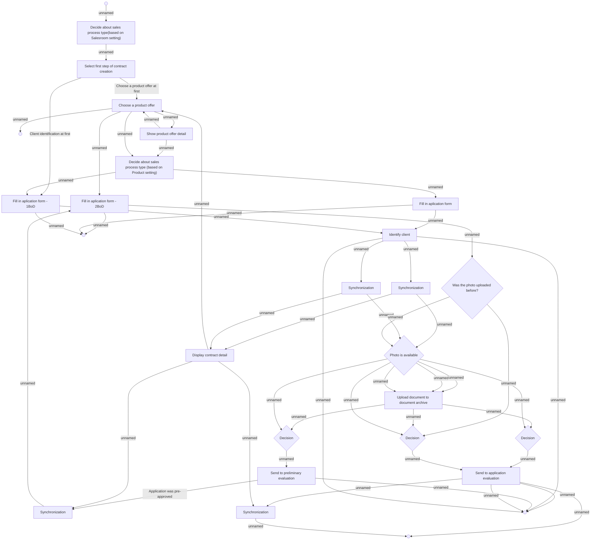

# 01.020 Create contract - 1SP

- **Diagram Type**: Activity
- **Package**: HomerSelect/BSL/Analysis Model/Contract Origination/COMMON for Contract origination/UseCase Model
- **Diagram ID**: 151368
- **Elements**: 34
- **Connectors**: 51

