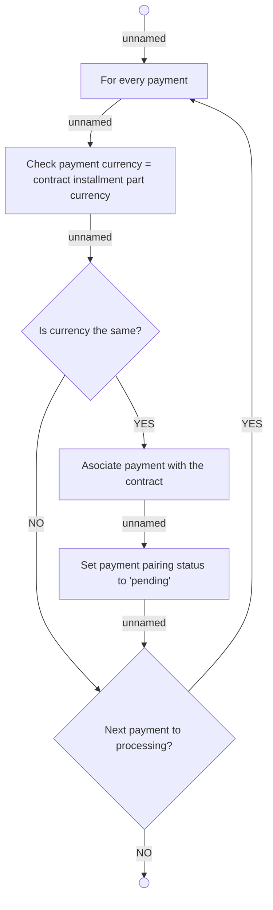

# 05.182 Pair payment with contract

- **Diagram Type**: Activity
- **Package**: HomerSelect/BSL/Analysis Model/Payments/Incoming payments/Pairing incomming payments/Use Case Model
- **Diagram ID**: 161905
- **Elements**: 8
- **Connectors**: 9

