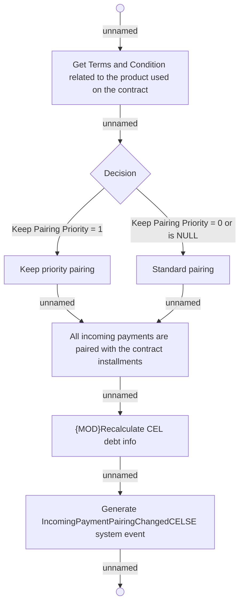

# AD - 05.180 Perform coupling payments with instalments

- **Diagram Type**: Activity
- **Package**: HomerSelect/BSL/Analysis Model/Payments/Incoming payments/Pairing incomming payments/Use Case Model
- **Diagram ID**: 161910
- **Elements**: 9
- **Connectors**: 9

