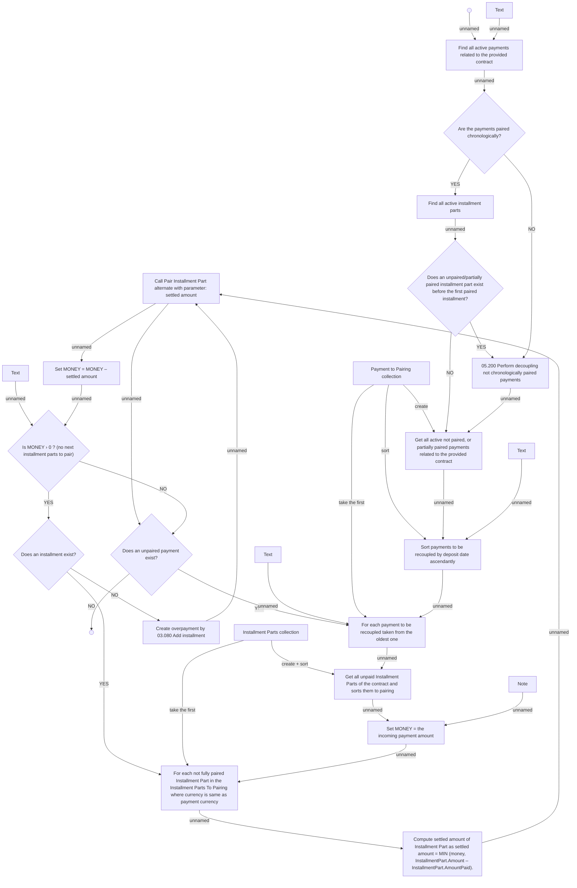

# Keep priority pairing

- **Diagram Type**: Activity
- **Package**: HomerSelect/BSL/Analysis Model/Payments/Incoming payments/Pairing incomming payments/Use Case Model
- **Diagram ID**: 161904
- **Elements**: 28
- **Connectors**: 35

