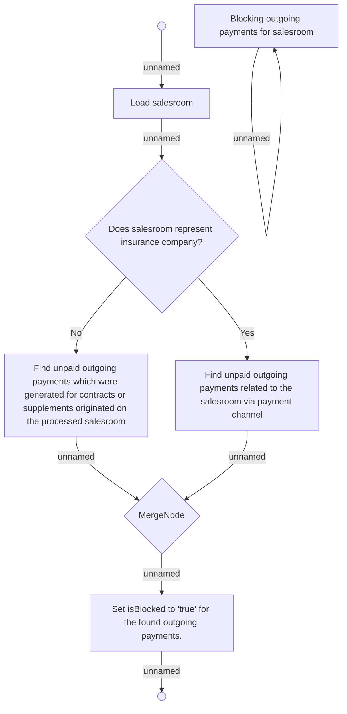

# Blocking outgoing payments for salesroom

- **Diagram Type**: Activity
- **Package**: HomerSelect/BSL/Analysis Model/Payments/Outgoing payments/Blocking outgoing payments/Business rules
- **Diagram ID**: 143424
- **Elements**: 10
- **Connectors**: 9

