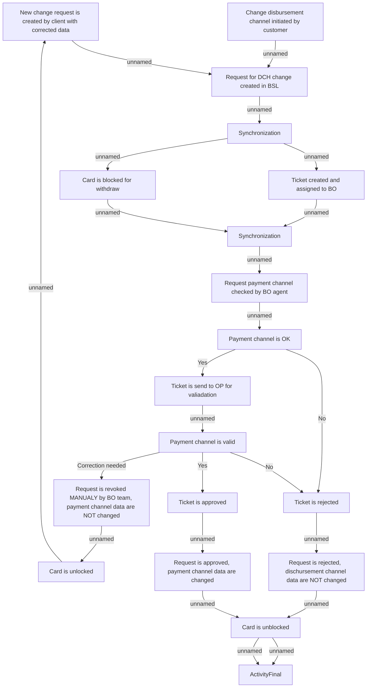

# Change disbursement channel - active contract

```mermaid
graph TD
    New_change_request_is_created_by_client_with_corrected_data["New change request is created by client with corrected data"]
    Card_is_unlocked["Card is unlocked"]
    ActivityFinal["ActivityFinal"]
    Card_is_unblocked["Card is unblocked"]
    Request_is_approved_payment_channel_data_are_changed["Request is approved, payment channel data are changed"]
    Ticket_is_approved["Ticket is approved"]
    Request_is_revoked_MANUALY_by_BO_team_payment_channel_data_a["Request is revoked MANUALY by BO team, payment channel data are NOT changed"]
    Payment_channel_is_valid["Payment channel is valid"]
    Card_is_unblocked["Card is unblocked "]
    Request_is_rejected_dischursement_channel_data_are_NOT_chang["Request is rejected,  dischursement channel data are NOT changed"]
    Ticket_is_rejected["Ticket is rejected"]
    Ticket_is_send_to_OP_for_valiadation["Ticket is send to OP for valiadation"]
    Payment_channel_is_OK["Payment channel is OK"]
    Request_payment_channel_checked_by_BO_agent["Request payment channel checked by BO agent"]
    el_1825416["Synchronization"]
    Card_is_blocked_for_withdraw["Card is blocked for withdraw"]
    Ticket_created_and_assigned_to_BO["Ticket created and assigned to BO"]
    el_1825424["Synchronization"]
    Request_for_DCH_change_created_in_BSL["Request for DCH change created in BSL"]
    Change_disbursement_channel_initiated_by_customer["Change disbursement channel initiated by customer"]
    Ticket_is_rejected -->|unnamed| Request_is_rejected_dischursement_channel_data_are_NOT_chang
    Change_disbursement_channel_initiated_by_customer -->|unnamed| Request_for_DCH_change_created_in_BSL
    Request_for_DCH_change_created_in_BSL -->|unnamed| el_1825424
    el_1825424 -->|unnamed| Ticket_created_and_assigned_to_BO
    el_1825424 -->|unnamed| Card_is_blocked_for_withdraw
    Ticket_created_and_assigned_to_BO -->|unnamed| el_1825416
    Card_is_blocked_for_withdraw -->|unnamed| el_1825416
    el_1825416 -->|unnamed| Request_payment_channel_checked_by_BO_agent
    Request_payment_channel_checked_by_BO_agent -->|unnamed| Payment_channel_is_OK
    Payment_channel_is_OK -->|Yes| Ticket_is_send_to_OP_for_valiadation
    New_change_request_is_created_by_client_with_corrected_data -->|unnamed| Request_for_DCH_change_created_in_BSL
    Payment_channel_is_OK -->|No| Ticket_is_rejected
    Card_is_unlocked -->|unnamed| New_change_request_is_created_by_client_with_corrected_data
    Request_is_rejected_dischursement_channel_data_are_NOT_chang -->|unnamed| Card_is_unblocked
    Ticket_is_send_to_OP_for_valiadation -->|unnamed| Payment_channel_is_valid
    Payment_channel_is_valid -->|Correction needed| Request_is_revoked_MANUALY_by_BO_team_payment_channel_data_a
    Payment_channel_is_valid -->|Yes| Ticket_is_approved
    Ticket_is_approved -->|unnamed| Request_is_approved_payment_channel_data_are_changed
    Request_is_approved_payment_channel_data_are_changed -->|unnamed| Card_is_unblocked
    Card_is_unblocked -->|unnamed| ActivityFinal
    Card_is_unblocked -->|unnamed| ActivityFinal
    Request_is_revoked_MANUALY_by_BO_team_payment_channel_data_a -->|unnamed| Card_is_unlocked
    Payment_channel_is_valid -->|No| Ticket_is_rejected
```
