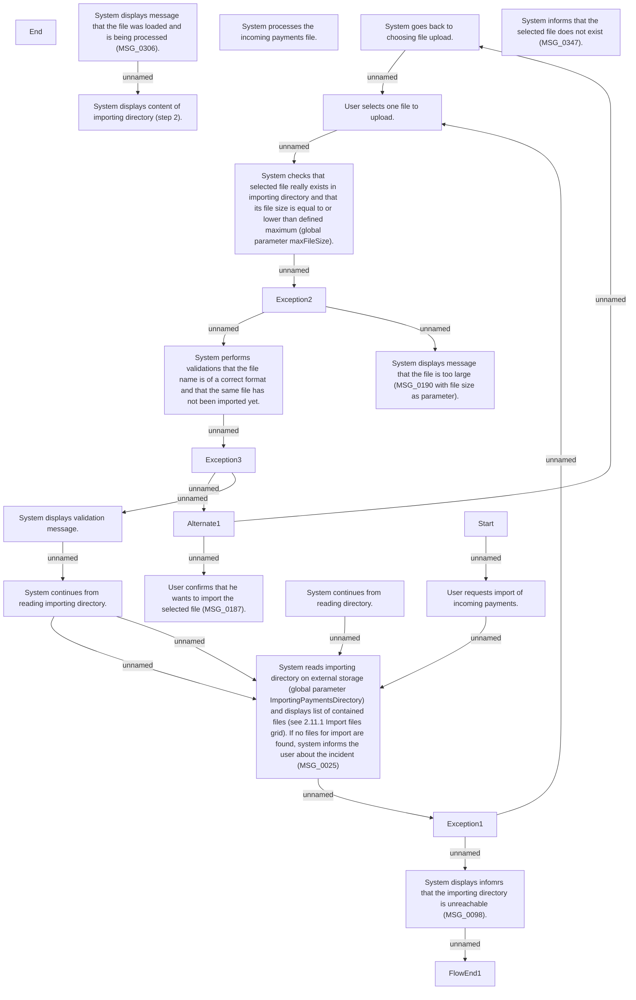

# 05.010 Import incoming payment file_ActivityGraph

```mermaid
graph TD
    End["End"]
    System_displays_content_of_importing_directory_step_2["System displays content of importing directory (step 2)."]
    System_displays_message_that_the_file_was_loaded_and_is_bein["System displays message that the file was loaded and is being processed (MSG_0306)."]
    System_processes_the_incoming_payments_file["System processes the incoming payments file."]
    User_confirms_that_he_wants_to_import_the_selected_file_MSG_["User confirms that he wants to import the selected file (MSG_0187)."]
    System_goes_back_to_choosing_file_upload["System goes back to choosing file upload."]
    Alternate1["Alternate1"]
    System_continues_from_reading_importing_directory["System continues from reading importing directory."]
    System_displays_validation_message["System displays validation message."]
    Exception3["Exception3"]
    System_performs_validations_that_the_file_name_is_of_a_corre["System performs validations that the file name is of a correct format and that the same file has not been imported yet."]
    System_continues_from_reading_directory["System continues from reading directory."]
    System_displays_message_that_the_file_is_too_large_MSG_0190_["System displays message that the file is too large (MSG_0190 with file size as parameter)."]
    System_continues_from_reading_directory["System continues from reading directory."]
    System_informs_that_the_selected_file_does_not_exist_MSG_034["System informs that the selected file does not exist (MSG_0347)."]
    Exception2["Exception2"]
    System_checks_that_selected_file_really_exists_in_importing_["System checks that selected file really exists in importing directory and that its file size is equal to or lower than defined maximum (global parameter maxFileSize)."]
    User_selects_one_file_to_upload["User selects one file to upload."]
    FlowEnd1["FlowEnd1"]
    System_displays_infomrs_that_the_importing_directory_is_unre["System displays infomrs that the importing directory is unreachable (MSG_0098)."]
    System_continues_from_reading_importing_directory["System continues from reading importing directory."]
    System_displays_validation_message["System displays validation message."]
    Exception1["Exception1"]
    System_reads_importing_directory_on_external_storage_global_["System reads importing directory on external storage (global parameter ImportingPaymentsDirectory) and displays list of contained files (see 2.11.1 Import files grid). If no files for import are found, system informs the user about the incident (MSG_0025)"]
    User_requests_import_of_incoming_payments["User requests import of incoming payments."]
    Start["Start"]
    System_checks_that_selected_file_really_exists_in_importing_ -->|unnamed| Exception2
    System_displays_message_that_the_file_was_loaded_and_is_bein -->|unnamed| System_displays_content_of_importing_directory_step_2
    Alternate1 -->|unnamed| User_confirms_that_he_wants_to_import_the_selected_file_MSG_
    Alternate1 -->|unnamed| System_goes_back_to_choosing_file_upload
    Exception3 -->|unnamed| Alternate1
    System_displays_validation_message -->|unnamed| System_continues_from_reading_importing_directory
    Exception3 -->|unnamed| System_displays_validation_message
    System_performs_validations_that_the_file_name_is_of_a_corre -->|unnamed| Exception3
    Exception2 -->|unnamed| System_performs_validations_that_the_file_name_is_of_a_corre
    Exception2 -->|unnamed| System_displays_message_that_the_file_is_too_large_MSG_0190_
    Start -->|unnamed| User_requests_import_of_incoming_payments
    User_selects_one_file_to_upload -->|unnamed| System_checks_that_selected_file_really_exists_in_importing_
    Exception1 -->|unnamed| User_selects_one_file_to_upload
    System_goes_back_to_choosing_file_upload -->|unnamed| User_selects_one_file_to_upload
    System_displays_infomrs_that_the_importing_directory_is_unre -->|unnamed| FlowEnd1
    Exception1 -->|unnamed| System_displays_infomrs_that_the_importing_directory_is_unre
    System_reads_importing_directory_on_external_storage_global_ -->|unnamed| Exception1
    System_continues_from_reading_importing_directory -->|unnamed| System_reads_importing_directory_on_external_storage_global_
    System_continues_from_reading_directory -->|unnamed| System_reads_importing_directory_on_external_storage_global_
    User_requests_import_of_incoming_payments -->|unnamed| System_reads_importing_directory_on_external_storage_global_
    System_continues_from_reading_importing_directory -->|unnamed| System_reads_importing_directory_on_external_storage_global_
```
