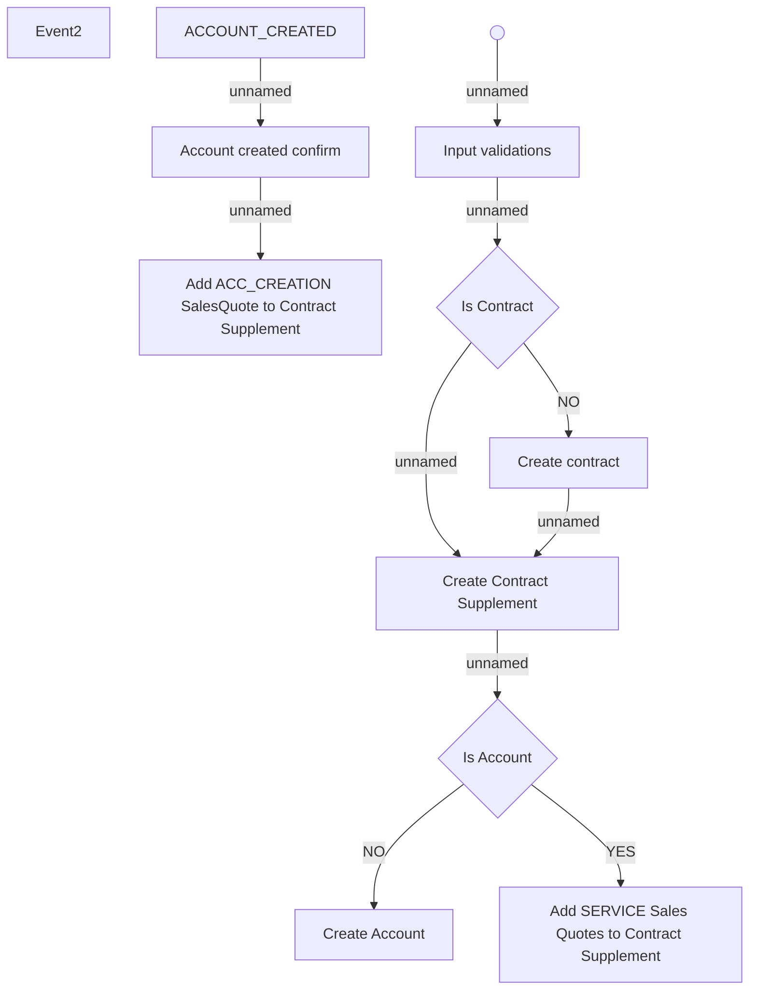

# Activity diagram

- **Diagram Type**: Activity
- **Package**: HomerSelect/BSL/Modules/Service Interpreter (SIR_NG)/Requirement Model/CBL-27126 BREIT-82 - COMA, SUP, COS, SIR MVP Functionalities/Activity diagram
- **Diagram ID**: 161509
- **Elements**: 12
- **Connectors**: 10

