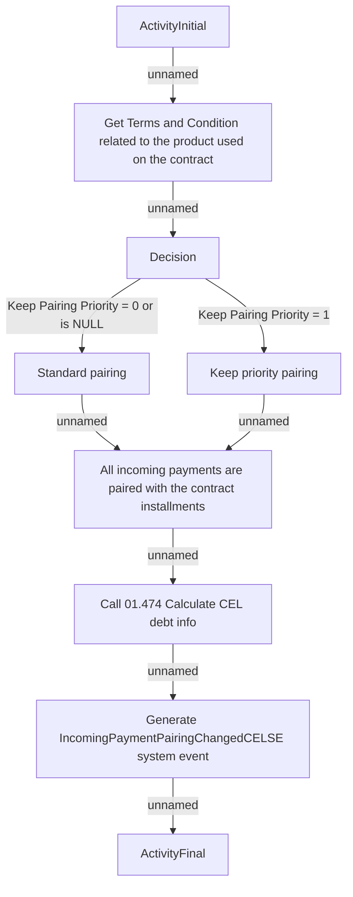

# AD - 05.180 Perform coupling payments with instalments

```mermaid
graph TD
    All_incoming_payments_are_paired_with_the_contract_installme["All incoming payments are paired with the contract installments"]
    ActivityFinal["ActivityFinal"]
    Generate_IncomingPaymentPairingChangedCELSE_system_event["Generate IncomingPaymentPairingChangedCELSE system event"]
    el_1519208["Decision"]
    ActivityInitial["ActivityInitial"]
    Get_Terms_and_Condition_related_to_the_product_used_on_the_c["Get Terms and Condition related to the product used on the contract"]
    Standard_pairing["Standard pairing"]
    Call_01_474_Calculate_CEL_debt_info["Call 01.474 Calculate CEL debt info"]
    Keep_priority_pairing["Keep priority pairing"]
    el_1519208 -->|Keep Pairing Priority = 1| Keep_priority_pairing
    All_incoming_payments_are_paired_with_the_contract_installme -->|unnamed| Call_01_474_Calculate_CEL_debt_info
    el_1519208 -->|Keep Pairing Priority = 0 or is NULL | Standard_pairing
    ActivityInitial -->|unnamed| Get_Terms_and_Condition_related_to_the_product_used_on_the_c
    Get_Terms_and_Condition_related_to_the_product_used_on_the_c -->|unnamed| el_1519208
    Call_01_474_Calculate_CEL_debt_info -->|unnamed| Generate_IncomingPaymentPairingChangedCELSE_system_event
    Generate_IncomingPaymentPairingChangedCELSE_system_event -->|unnamed| ActivityFinal
    Standard_pairing -->|unnamed| All_incoming_payments_are_paired_with_the_contract_installme
    Keep_priority_pairing -->|unnamed| All_incoming_payments_are_paired_with_the_contract_installme
```
