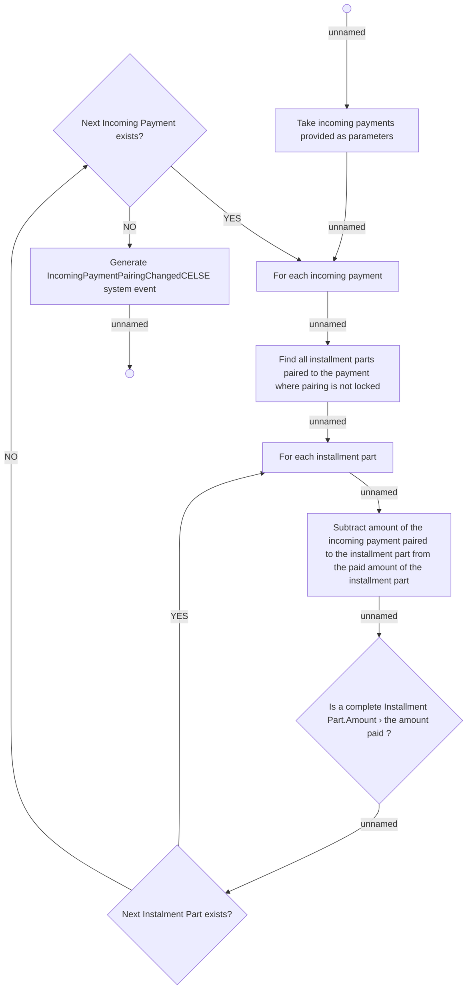

# AD - 05.200 Perform decoupling

- **Diagram Type**: Activity
- **Package**: HomerSelect/BSL/Requirements Model/In process/IS/IS-620 (CBL-7897) Prevent exceeding maximum number of installment versions
- **Diagram ID**: 127623
- **Elements**: 11
- **Connectors**: 12

