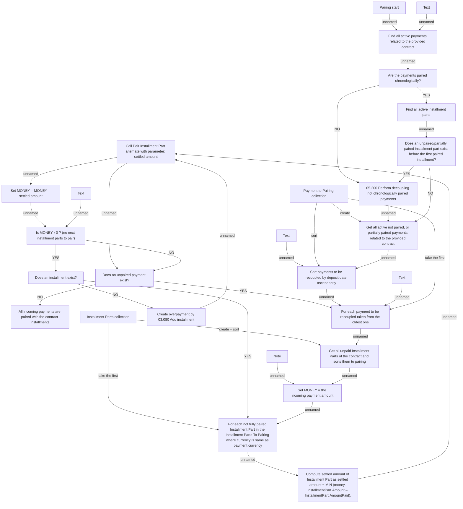

# Keep priority pairing

```mermaid
graph TD
    Call_Pair_Installment_Part_alternate_with_parameter_settled_["Call Pair Installment Part alternate with parameter: settled amount = MONEY"]
    All_incoming_payments_are_paired_with_the_contract_installme["All incoming payments are paired with the contract installments"]
    Call_Pair_Installment_Part_alternate_with_parameter_settled_["Call Pair Installment Part alternate with parameter: settled amount"]
    Get_all_unpaid_Installment_Parts_of_the_contract_and_sorts_t["Get all unpaid Installment Parts of the contract and sorts them to pairing "]
    Installment_Parts_collection["Installment Parts collection"]
    Find_all_active_installment_parts["Find all active installment parts"]
    Does_an_unpaired_partially_paired_installment_part_exist_bef["Does an unpaired/partially paired installment part exist before the first paired installment?"]
    Payment_to_Pairing_collection["Payment to Pairing collection"]
    el_1519189["Text"]
    Does_an_installment_exist["Does an installment exist?"]
    Does_an_unpaired_payment_exist["Does an unpaired payment exist?"]
    el_1519193["Text"]
    Create_overpayment_by_03_080_Add_installment["Create overpayment by 03.080 Add installment"]
    Is_MONEY_0_no_next_installment_parts_to_pair["Is MONEY › 0 ? (no next installment parts to pair) "]
    Set_MONEY_MONEY_settled_amount["Set MONEY = MONEY – settled amount"]
    Compute_settled_amount_of_Installment_Part_as_settled_amount["Compute settled amount of Installment Part as settled amount = MIN (money, InstallmentPart.Amount – InstallmentPart.AmountPaid)."]
    For_each_not_fully_paired_Installment_Part_in_the_Installmen["For each not fully paired Installment Part in the Installment Parts To Pairing where currency is same as payment currency"]
    el_1519190["Note"]
    Set_MONEY_the_incoming_payment_amount["Set MONEY = the incoming payment amount"]
    For_each_payment_to_be_recoupled_taken_from_the_oldest_one["For each payment to be recoupled taken from the oldest one"]
    el_1519191["Text"]
    el_1519188["Text"]
    Find_all_active_payments_related_to_the_provided_contract["Find all active payments related to the provided contract"]
    Sort_payments_to_be_recoupled_by_deposit_date_ascendantly["Sort payments to be recoupled by deposit date ascendantly"]
    Get_all_active_not_paired_or_partially_paired_payments_relat["Get all active not paired, or partially paired payments related to the provided contract"]
    Are_the_payments_paired_chronologically["Are the payments paired chronologically?"]
    n_05_200_Perform_decoupling_not_chronologically_paired_payme["05.200 Perform decoupling not chronologically paired payments "]
    Pairing_start["Pairing start"]
    Is_MONEY_0_no_next_installment_parts_to_pair -->|YES| Does_an_installment_exist
    Installment_Parts_collection -->|take the first| For_each_not_fully_paired_Installment_Part_in_the_Installmen
    For_each_not_fully_paired_Installment_Part_in_the_Installmen -->|unnamed| Compute_settled_amount_of_Installment_Part_as_settled_amount
    Call_Pair_Installment_Part_alternate_with_parameter_settled_ -->|unnamed| Set_MONEY_MONEY_settled_amount
    Set_MONEY_MONEY_settled_amount -->|unnamed| Is_MONEY_0_no_next_installment_parts_to_pair
    el_1519193 -->|unnamed| Is_MONEY_0_no_next_installment_parts_to_pair
    Does_an_installment_exist -->|NO| Create_overpayment_by_03_080_Add_installment
    Create_overpayment_by_03_080_Add_installment -->|unnamed| Call_Pair_Installment_Part_alternate_with_parameter_settled_
    Call_Pair_Installment_Part_alternate_with_parameter_settled_ -->|unnamed| Does_an_unpaired_payment_exist
    el_1519190 -->|unnamed| Set_MONEY_the_incoming_payment_amount
    Find_all_active_installment_parts -->|unnamed| Does_an_unpaired_partially_paired_installment_part_exist_bef
    Are_the_payments_paired_chronologically -->|YES| Find_all_active_installment_parts
    Installment_Parts_collection -->|create + sort| Get_all_unpaid_Installment_Parts_of_the_contract_and_sorts_t
    For_each_payment_to_be_recoupled_taken_from_the_oldest_one -->|unnamed| Get_all_unpaid_Installment_Parts_of_the_contract_and_sorts_t
    Compute_settled_amount_of_Installment_Part_as_settled_amount -->|unnamed| Call_Pair_Installment_Part_alternate_with_parameter_settled_
    Does_an_unpaired_payment_exist -->|NO| All_incoming_payments_are_paired_with_the_contract_installme
    Is_MONEY_0_no_next_installment_parts_to_pair -->|NO| Does_an_unpaired_payment_exist
    Pairing_start -->|unnamed| Find_all_active_payments_related_to_the_provided_contract
    Are_the_payments_paired_chronologically -->|NO| n_05_200_Perform_decoupling_not_chronologically_paired_payme
    Find_all_active_payments_related_to_the_provided_contract -->|unnamed| Are_the_payments_paired_chronologically
    Payment_to_Pairing_collection -->|create| Get_all_active_not_paired_or_partially_paired_payments_relat
    n_05_200_Perform_decoupling_not_chronologically_paired_payme -->|unnamed| Get_all_active_not_paired_or_partially_paired_payments_relat
    Does_an_unpaired_partially_paired_installment_part_exist_bef -->|NO| Get_all_active_not_paired_or_partially_paired_payments_relat
    el_1519191 -->|unnamed| Sort_payments_to_be_recoupled_by_deposit_date_ascendantly
    Does_an_installment_exist -->|YES| For_each_not_fully_paired_Installment_Part_in_the_Installmen
    Payment_to_Pairing_collection -->|sort| Sort_payments_to_be_recoupled_by_deposit_date_ascendantly
    Set_MONEY_the_incoming_payment_amount -->|unnamed| For_each_not_fully_paired_Installment_Part_in_the_Installmen
    el_1519188 -->|unnamed| Find_all_active_payments_related_to_the_provided_contract
    Does_an_unpaired_payment_exist -->|YES| For_each_payment_to_be_recoupled_taken_from_the_oldest_one
    Sort_payments_to_be_recoupled_by_deposit_date_ascendantly -->|unnamed| For_each_payment_to_be_recoupled_taken_from_the_oldest_one
    el_1519189 -->|unnamed| For_each_payment_to_be_recoupled_taken_from_the_oldest_one
    Payment_to_Pairing_collection -->|take the first| For_each_payment_to_be_recoupled_taken_from_the_oldest_one
    Get_all_unpaid_Installment_Parts_of_the_contract_and_sorts_t -->|unnamed| Set_MONEY_the_incoming_payment_amount
    Does_an_unpaired_partially_paired_installment_part_exist_bef -->|YES| n_05_200_Perform_decoupling_not_chronologically_paired_payme
    Get_all_active_not_paired_or_partially_paired_payments_relat -->|unnamed| Sort_payments_to_be_recoupled_by_deposit_date_ascendantly
```
