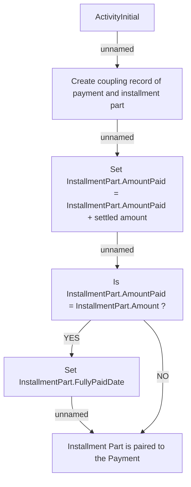

# Pair Installment Part

```mermaid
graph TD
    Set_InstallmentPart_FullyPaidDate["Set InstallmentPart.FullyPaidDate"]
    Is_InstallmentPart_AmountPaid_InstallmentPart_Amount["Is InstallmentPart.AmountPaid = InstallmentPart.Amount ?"]
    Set_InstallmentPart_AmountPaid_InstallmentPart_AmountPaid_se["Set InstallmentPart.AmountPaid = InstallmentPart.AmountPaid + settled amount"]
    Installment_Part_is_paired_to_the_Payment["Installment Part is paired to the Payment"]
    Create_coupling_record_of_payment_and_installment_part["Create coupling record of payment and installment part"]
    ActivityInitial["ActivityInitial"]
    ActivityInitial -->|unnamed| Create_coupling_record_of_payment_and_installment_part
    Set_InstallmentPart_FullyPaidDate -->|unnamed| Installment_Part_is_paired_to_the_Payment
    Is_InstallmentPart_AmountPaid_InstallmentPart_Amount -->|NO| Installment_Part_is_paired_to_the_Payment
    Create_coupling_record_of_payment_and_installment_part -->|unnamed| Set_InstallmentPart_AmountPaid_InstallmentPart_AmountPaid_se
    Set_InstallmentPart_AmountPaid_InstallmentPart_AmountPaid_se -->|unnamed| Is_InstallmentPart_AmountPaid_InstallmentPart_Amount
    Is_InstallmentPart_AmountPaid_InstallmentPart_Amount -->|YES| Set_InstallmentPart_FullyPaidDate
```
