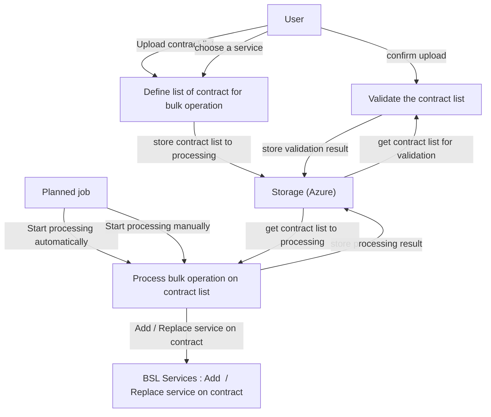

# Loan Service Bulk operations - DFD

```mermaid
graph TD
    Validate_the_contract_list["Validate the contract list"]
    Process_bulk_operation_on_contract_list["Process bulk operation on contract list"]
    BSL_Services_Add_Replace_service_on_contract["BSL Services : Add  / Replace service on contract"]
    Planned_job["Planned job"]
    Storage_Azure["Storage (Azure)"]
    User["User"]
    Define_list_of_contract_for_bulk_operation["Define list of contract for bulk operation"]
    User -->|Upload contract list| Define_list_of_contract_for_bulk_operation
    User -->|choose a service| Define_list_of_contract_for_bulk_operation
    Validate_the_contract_list -->|store validation result| Storage_Azure
    Process_bulk_operation_on_contract_list -->|store processing result| Storage_Azure
    Define_list_of_contract_for_bulk_operation -->|store contract list to processing| Storage_Azure
    Process_bulk_operation_on_contract_list -->|Add / Replace service on contract| BSL_Services_Add_Replace_service_on_contract
    Planned_job -->|Start processing automatically| Process_bulk_operation_on_contract_list
    Planned_job -->|Start processing manually| Process_bulk_operation_on_contract_list
    Storage_Azure -->|get contract list to processing| Process_bulk_operation_on_contract_list
    Storage_Azure -->|get contract list for validation| Validate_the_contract_list
    User -->|confirm upload| Validate_the_contract_list
```
