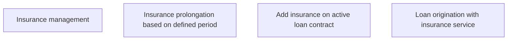

# Insurance business processes

```mermaid
graph TD
    Insurance_management["Insurance management"]
    Insurance_prolongation_based_on_defined_period["Insurance prolongation based on defined period"]
    Add_insurance_on_active_loan_contract["Add insurance on active loan contract"]
    Loan_origination_with_insurance_service["Loan origination with insurance service"]
```
