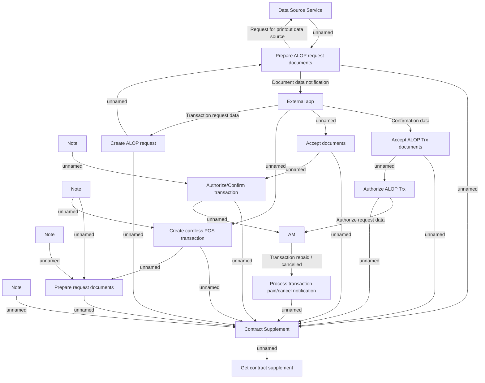

# Processing Cardless Transaction request

```mermaid
graph TD
    el_1748407["Note"]
    el_1748411["Note"]
    Get_contract_supplement["Get contract supplement"]
    el_1748413["Note"]
    el_1748395["Note"]
    Authorize_Confirm_transaction["Authorize/Confirm transaction"]
    Accept_documents["Accept documents"]
    Prepare_request_documents["Prepare request documents"]
    Create_cardless_POS_transaction["Create cardless POS transaction"]
    Process_transaction_paid_cancel_notification["Process transaction paid/cancel notification"]
    Data_Source_Service["Data Source Service"]
    AM["AM"]
    Authorize_ALOP_Trx["Authorize ALOP Trx"]
    External_app["External app"]
    Accept_ALOP_Trx_documents["Accept ALOP Trx documents"]
    Prepare_ALOP_request_documents["Prepare ALOP request documents"]
    Contract_Supplement["Contract Supplement"]
    External_app["External app"]
    Create_ALOP_request["Create ALOP request"]
    Authorize_Confirm_transaction -->|unnamed| Contract_Supplement
    Accept_documents -->|unnamed| Contract_Supplement
    Prepare_request_documents -->|unnamed| Contract_Supplement
    Create_cardless_POS_transaction -->|unnamed| Contract_Supplement
    Process_transaction_paid_cancel_notification -->|unnamed| Contract_Supplement
    el_1748407 -->|unnamed| Contract_Supplement
    Create_ALOP_request -->|unnamed| Contract_Supplement
    Prepare_ALOP_request_documents -->|unnamed| Contract_Supplement
    Accept_ALOP_Trx_documents -->|unnamed| Contract_Supplement
    Accept_ALOP_Trx_documents -->|unnamed| Authorize_ALOP_Trx
    External_app -->|Confirmation data| Accept_ALOP_Trx_documents
    Accept_documents -->|unnamed| Authorize_Confirm_transaction
    el_1748395 -->|unnamed| Authorize_Confirm_transaction
    External_app -->|unnamed| Accept_documents
    el_1748411 -->|unnamed| Prepare_request_documents
    Create_cardless_POS_transaction -->|unnamed| Prepare_request_documents
    el_1748413 -->|unnamed| Prepare_request_documents
    el_1748413 -->|unnamed| Create_cardless_POS_transaction
    External_app -->|unnamed| Create_cardless_POS_transaction
    AM -->|Transaction repaid / cancelled| Process_transaction_paid_cancel_notification
    Prepare_ALOP_request_documents -->|Request for printout data source | Data_Source_Service
    Authorize_Confirm_transaction -->|unnamed| AM
    Authorize_ALOP_Trx -->|Authorize request data| AM
    Contract_Supplement -->|unnamed| Get_contract_supplement
    Prepare_ALOP_request_documents -->|Document data notification| External_app
    External_app -->|Transaction request data| Create_ALOP_request
    Create_ALOP_request -->|unnamed| Prepare_ALOP_request_documents
    Data_Source_Service -->|unnamed| Prepare_ALOP_request_documents
    Authorize_ALOP_Trx -->|unnamed| Contract_Supplement
```
