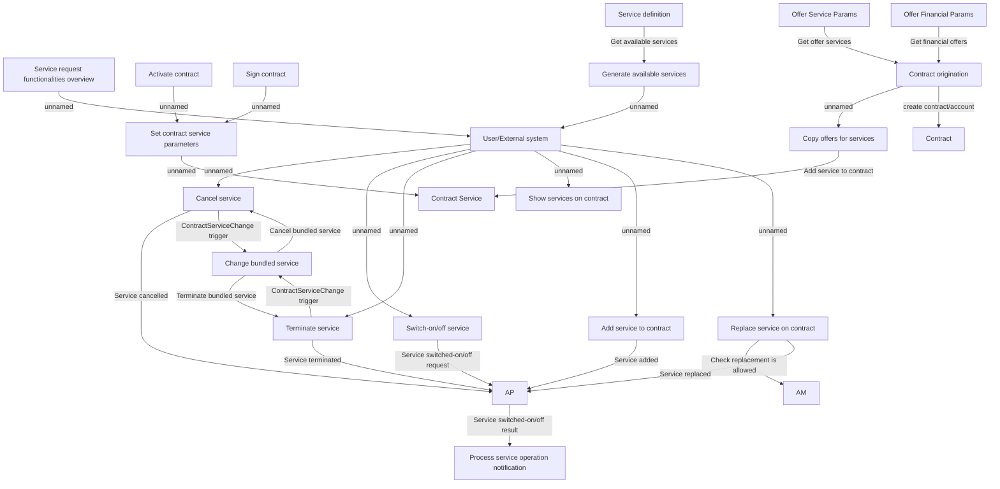

# Service functionalities overview (current status)

```mermaid
graph TD
    Service_request_functionalities_overview["Service request functionalities overview"]
    Show_services_on_contract["Show services on contract"]
    Process_service_operation_notification["Process service operation notification"]
    Activate_contract["Activate contract"]
    Sign_contract["Sign contract"]
    Set_contract_service_parameters["Set contract service parameters"]
    Change_bundled_service["Change bundled service"]
    Cancel_service["Cancel service"]
    Copy_offers_for_services["Copy offers for services"]
    Switch_on_off_service["Switch-on/off service"]
    Terminate_service["Terminate service"]
    Replace_service_on_contract["Replace service on contract"]
    AM["AM"]
    Service_definition["Service definition"]
    AP["AP"]
    Generate_available_services["Generate available services"]
    User_External_system["User/External system"]
    Contract_Service["Contract Service"]
    Contract["Contract"]
    Offer_Service_Params["Offer Service Params"]
    Offer_Financial_Params["Offer Financial Params"]
    Contract_origination["Contract origination"]
    Add_service_to_contract["Add service to contract"]
    Cancel_service -->|Service cancelled| AP
    AP -->|Service switched-on/off result| Process_service_operation_notification
    Activate_contract -->|unnamed| Set_contract_service_parameters
    Sign_contract -->|unnamed| Set_contract_service_parameters
    Cancel_service -->|ContractServiceChange trigger| Change_bundled_service
    Terminate_service -->|ContractServiceChange trigger| Change_bundled_service
    Change_bundled_service -->|Cancel bundled service| Cancel_service
    User_External_system -->|unnamed| Cancel_service
    Contract_origination -->|unnamed| Copy_offers_for_services
    User_External_system -->|unnamed| Switch_on_off_service
    User_External_system -->|unnamed| Terminate_service
    Change_bundled_service -->|Terminate bundled service| Terminate_service
    User_External_system -->|unnamed| Show_services_on_contract
    Replace_service_on_contract -->|Check replacement is allowed| AM
    User_External_system -->|unnamed| Add_service_to_contract
    Switch_on_off_service -->|Service switched-on/off request| AP
    Terminate_service -->|Service terminated| AP
    Replace_service_on_contract -->|Service replaced| AP
    Add_service_to_contract -->|Service added| AP
    Service_definition -->|Get available services| Generate_available_services
    Generate_available_services -->|unnamed| User_External_system
    Service_request_functionalities_overview -->|unnamed| User_External_system
    Set_contract_service_parameters -->|unnamed| Contract_Service
    Copy_offers_for_services -->|Add service to contract| Contract_Service
    Contract_origination -->|create contract/account| Contract
    Offer_Service_Params -->|Get offer services| Contract_origination
    Offer_Financial_Params -->|Get financial offers| Contract_origination
    User_External_system -->|unnamed| Replace_service_on_contract
```
