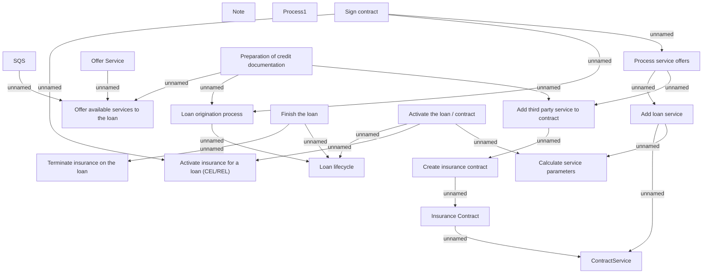

# Service functionalities overview (proposal)

```mermaid
graph TD
    el_1748576["Note"]
    SQS["SQS"]
    Process1["Process1"]
    Add_third_party_service_to_contract["Add third party service to contract"]
    Add_loan_service["Add loan service"]
    Process_service_offers["Process service offers"]
    Create_insurance_contract["Create insurance contract"]
    Calculate_service_parameters["Calculate service parameters"]
    Offer_available_services_to_the_loan["Offer available services to the loan"]
    Loan_lifecycle["Loan lifecycle"]
    Offer_Service["Offer Service"]
    Terminate_insurance_on_the_loan["Terminate insurance on the loan"]
    Finish_the_loan["Finish the loan"]
    Insurance_Contract["Insurance Contract"]
    ContractService["ContractService"]
    Activate_the_loan_contract["Activate the loan / contract"]
    Sign_contract["Sign contract"]
    Preparation_of_credit_documentation["Preparation of credit documentation"]
    Loan_origination_process["Loan origination process"]
    Activate_insurance_for_a_loan_CEL_REL["Activate insurance for a loan (CEL/REL)"]
    Loan_origination_process -->|unnamed| Loan_lifecycle
    Process_service_offers -->|unnamed| Add_third_party_service_to_contract
    Process_service_offers -->|unnamed| Add_loan_service
    Sign_contract -->|unnamed| Process_service_offers
    Add_third_party_service_to_contract -->|unnamed| Create_insurance_contract
    Activate_the_loan_contract -->|unnamed| Calculate_service_parameters
    Add_loan_service -->|unnamed| Calculate_service_parameters
    SQS -->|unnamed| Offer_available_services_to_the_loan
    Offer_Service -->|unnamed| Offer_available_services_to_the_loan
    Preparation_of_credit_documentation -->|unnamed| Add_third_party_service_to_contract
    Finish_the_loan -->|unnamed| Loan_lifecycle
    Activate_the_loan_contract -->|unnamed| Activate_insurance_for_a_loan_CEL_REL
    Activate_the_loan_contract -->|unnamed| Loan_lifecycle
    Finish_the_loan -->|unnamed| Terminate_insurance_on_the_loan
    Create_insurance_contract -->|unnamed| Insurance_Contract
    Insurance_Contract -->|unnamed| ContractService
    Add_loan_service -->|unnamed| ContractService
    Sign_contract -->|unnamed| Loan_origination_process
    Preparation_of_credit_documentation -->|unnamed| Loan_origination_process
    Sign_contract -->|unnamed| Activate_insurance_for_a_loan_CEL_REL
    Preparation_of_credit_documentation -->|unnamed| Offer_available_services_to_the_loan
```
