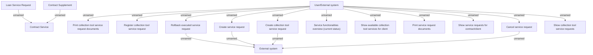

# Service request functionalities overview

```mermaid
graph TD
    Rollback_executed_service_request["Rollback executed service request"]
    External_system["External system"]
    Print_collection_tool_service_request_documents["Print collection tool service request documents"]
    Register_collection_tool_service_request["Register collection tool service request"]
    Show_collection_tool_service_requests["Show collection tool service requests"]
    Contract_Service["Contract Service"]
    Contract_Supplement["Contract Supplement"]
    Create_collection_tool_service_request["Create collection tool service request"]
    Service_functionalities_overview_current_status["Service functionalities overview (current status)"]
    Show_available_collection_tool_services_for_client["Show available collection tool services for client"]
    Print_service_request_documents["Print service request documents"]
    Show_service_requests_for_contract_client["Show service requests for contract/client"]
    Loan_Service_Request["Loan Service Request"]
    Cancel_service_request["Cancel service request"]
    Create_service_request["Create service request"]
    User_External_system["User/External system"]
    Loan_Service_Request -->|unnamed| Contract_Service
    Create_collection_tool_service_request -->|unnamed| External_system
    Rollback_executed_service_request -->|unnamed| External_system
    Create_service_request -->|unnamed| External_system
    Cancel_service_request -->|unnamed| External_system
    User_External_system -->|unnamed| Print_collection_tool_service_request_documents
    User_External_system -->|unnamed| Register_collection_tool_service_request
    User_External_system -->|unnamed| Rollback_executed_service_request
    Contract_Supplement -->|unnamed| Contract_Service
    User_External_system -->|unnamed| Create_service_request
    User_External_system -->|unnamed| Create_collection_tool_service_request
    User_External_system -->|unnamed| Service_functionalities_overview_current_status
    User_External_system -->|unnamed| Show_available_collection_tool_services_for_client
    User_External_system -->|unnamed| Print_service_request_documents
    User_External_system -->|unnamed| Show_service_requests_for_contract_client
    User_External_system -->|unnamed| Cancel_service_request
    User_External_system -->|unnamed| Show_collection_tool_service_requests
```
