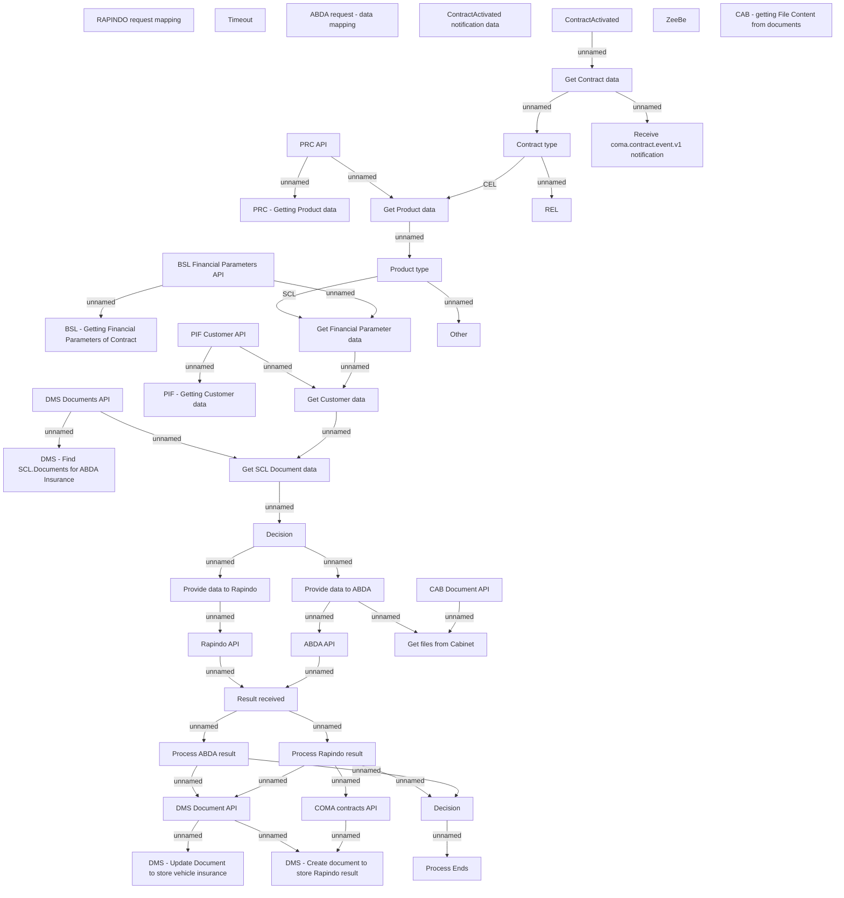

# SCL After Activation Process

```mermaid
graph TD
    COMA_contracts_API["COMA contracts API"]
    BSL_Financial_Parameters_API["BSL Financial Parameters API"]
    BSL_Getting_Financial_Parameters_of_Contract["BSL - Getting Financial Parameters of Contract"]
    Get_Financial_Parameter_data["Get Financial Parameter data"]
    DMS_Create_document_to_store_Rapindo_result["DMS - Create document to store Rapindo result"]
    DMS_Update_Document_to_store_vehicle_insurance["DMS - Update Document to store vehicle insurance"]
    Process_Ends["Process Ends"]
    el_1742222["Decision"]
    Result_received["Result received"]
    Rapindo_API["Rapindo API"]
    RAPINDO_request_mapping["RAPINDO request mapping"]
    Timeout["Timeout"]
    Process_Rapindo_result["Process Rapindo result"]
    Provide_data_to_Rapindo["Provide data to Rapindo"]
    el_1742239["Decision"]
    DMS_Document_API["DMS Document API"]
    Result_received["Result received"]
    Timeout["Timeout"]
    Process_ABDA_result["Process ABDA result"]
    ABDA_request_data_mapping["ABDA request - data mapping"]
    ABDA_API["ABDA API"]
    Provide_data_to_ABDA["Provide data to ABDA"]
    CAB_Document_API["CAB Document API"]
    Get_files_from_Cabinet["Get files from Cabinet"]
    DMS_Find_SCL_Documents_for_ABDA_Insurance["DMS - Find SCL.Documents for ABDA Insurance"]
    DMS_Documents_API["DMS Documents API"]
    Get_SCL_Document_data["Get SCL Document data"]
    PRC_Getting_Product_data["PRC - Getting Product data"]
    PIF_Getting_Customer_data["PIF - Getting Customer data"]
    PIF_Customer_API["PIF Customer API"]
    Get_Customer_data["Get Customer data"]
    PRC_API["PRC API"]
    Other["Other"]
    Product_type["Product type"]
    Get_Product_data["Get Product data"]
    REL["REL"]
    Contract_type["Contract type"]
    Receive_coma_contract_event_v1_notification["Receive coma.contract.event.v1 notification"]
    ContractActivated_notification_data["ContractActivated notification data"]
    Get_Contract_data["Get Contract data"]
    ContractActivated["ContractActivated"]
    ZeeBe["ZeeBe"]
    CAB_getting_File_Content_from_documents["CAB - getting File Content from documents"]
    Result_received -->|unnamed| Process_Rapindo_result
    el_1742239 -->|unnamed| Provide_data_to_ABDA
    Provide_data_to_ABDA -->|unnamed| ABDA_API
    Result_received -->|unnamed| Process_ABDA_result
    ABDA_API -->|unnamed| Result_received
    Process_Rapindo_result -->|unnamed| DMS_Document_API
    Process_ABDA_result -->|unnamed| DMS_Document_API
    COMA_contracts_API -->|unnamed| DMS_Create_document_to_store_Rapindo_result
    el_1742239 -->|unnamed| Provide_data_to_Rapindo
    DMS_Documents_API -->|unnamed| DMS_Find_SCL_Documents_for_ABDA_Insurance
    Provide_data_to_Rapindo -->|unnamed| Rapindo_API
    Rapindo_API -->|unnamed| Result_received
    Process_ABDA_result -->|unnamed| el_1742222
    Process_Rapindo_result -->|unnamed| el_1742222
    el_1742222 -->|unnamed| Process_Ends
    DMS_Document_API -->|unnamed| DMS_Update_Document_to_store_vehicle_insurance
    DMS_Document_API -->|unnamed| DMS_Create_document_to_store_Rapindo_result
    Get_SCL_Document_data -->|unnamed| el_1742239
    Get_Product_data -->|unnamed| Product_type
    BSL_Financial_Parameters_API -->|unnamed| BSL_Getting_Financial_Parameters_of_Contract
    BSL_Financial_Parameters_API -->|unnamed| Get_Financial_Parameter_data
    Product_type -->|SCL| Get_Financial_Parameter_data
    ContractActivated -->|unnamed| Get_Contract_data
    Get_Contract_data -->|unnamed| Receive_coma_contract_event_v1_notification
    Get_Contract_data -->|unnamed| Contract_type
    Contract_type -->|unnamed| REL
    CAB_Document_API -->|unnamed| Get_files_from_Cabinet
    Contract_type -->|CEL| Get_Product_data
    Provide_data_to_ABDA -->|unnamed| Get_files_from_Cabinet
    Product_type -->|unnamed| Other
    Get_Financial_Parameter_data -->|unnamed| Get_Customer_data
    PIF_Customer_API -->|unnamed| Get_Customer_data
    PIF_Customer_API -->|unnamed| PIF_Getting_Customer_data
    PRC_API -->|unnamed| PRC_Getting_Product_data
    Get_Customer_data -->|unnamed| Get_SCL_Document_data
    DMS_Documents_API -->|unnamed| Get_SCL_Document_data
    Process_Rapindo_result -->|unnamed| COMA_contracts_API
    PRC_API -->|unnamed| Get_Product_data
```
