# Contract signature component integration

- **Diagram Type**: Component
- **Package**: HomerSelect/BSL/Analysis Model/Contract Origination/Contract signing/Component model
- **Diagram ID**: 75416
- **Elements**: 42
- **Connectors**: 21

```mermaid
graph TD
    GeneratedMessages(("GeneratedMessages"))
    ConsumedMessages(("ConsumedMessages"))
    DebtNotificationService(("DebtNotificationService"))
    ConsumedMessages(("ConsumedMessages"))
    GeneratedMessages(("GeneratedMessages"))
    ConsumedMessages(("ConsumedMessages"))
    GeneratedMessages(("GeneratedMessages"))
    LoyaltyManagementWS(("LoyaltyManagementWS"))
    LoyaltyManagementWS(("LoyaltyManagementWS"))
    CustomerWS(("CustomerWS"))
    CustomerWS(("CustomerWS"))
    InstallmentPlanWS(("InstallmentPlanWS"))
    InstalmentPlanWS(("InstalmentPlanWS"))
    CardManagement(("CardManagement"))
    ReportWS(("ReportWS"))
    FinancialPartnershipService(("FinancialPartnershipService"))
    FinancialPartnershipService(("FinancialPartnershipService"))
    ReportWS(("ReportWS"))
    CabinetWS(("CabinetWS"))
    CabinetWS(("CabinetWS"))
    CardManagement(("CardManagement"))
    AccountTransactionWS(("AccountTransactionWS"))
    AccountManagementWS(("AccountManagementWS"))
    AccountNotificationWS(("AccountNotificationWS"))
    AccountTransactionWS(("AccountTransactionWS"))
    AccountNotificationWS(("AccountNotificationWS"))
    AccountManagementWS(("AccountManagementWS"))
    OSB[["OSB"]]
    LCS[["LCS"]]
    OBS[["OBS"]]
    CBSA[["CBSA"]]
    LRP[["LRP"]]
    CIF[["CIF"]]
    Contract_Management[["Contract Management"]]
    JFS_support[["JFS support"]]
    PSS[["PSS"]]
    Cabinet[["Cabinet"]]
    CMS[["CMS"]]
    Application_origination[["Application origination"]]
    REL_Account_Management[["REL Account Management"]]
    BSL["BSL"]
    Country_specific_component["Country specific component"]
    CBSA -->|unnamed| OBS
    AccountNotificationWS -->|unnamed| AccountNotificationWS
    InstallmentPlanWS -->|unnamed| InstalmentPlanWS
    CustomerWS -->|unnamed| CustomerWS
    CabinetWS -->|unnamed| CabinetWS
    AccountTransactionWS -->|unnamed| AccountTransactionWS
    AccountManagementWS -->|unnamed| AccountManagementWS
    GeneratedMessages -->|unnamed| ConsumedMessages
    GeneratedMessages -->|unnamed| ConsumedMessages
    ReportWS -->|unnamed| ReportWS
    CardManagement -->|unnamed| CardManagement
    GeneratedMessages -->|unnamed| ConsumedMessages
    GeneratedMessages -->|unnamed| ConsumedMessages
    GeneratedMessages -->|unnamed| ConsumedMessages
    GeneratedMessages -->|unnamed| ConsumedMessages
    GeneratedMessages -->|unnamed| ConsumedMessages
    GeneratedMessages -->|unnamed| ConsumedMessages
    LoyaltyManagementWS -->|unnamed| LoyaltyManagementWS
    Application_origination -->|Insurance| Contract_Management
    Application_origination -->|Contract signature| Contract_Management
    FinancialPartnershipService -->|unnamed| FinancialPartnershipService
```

