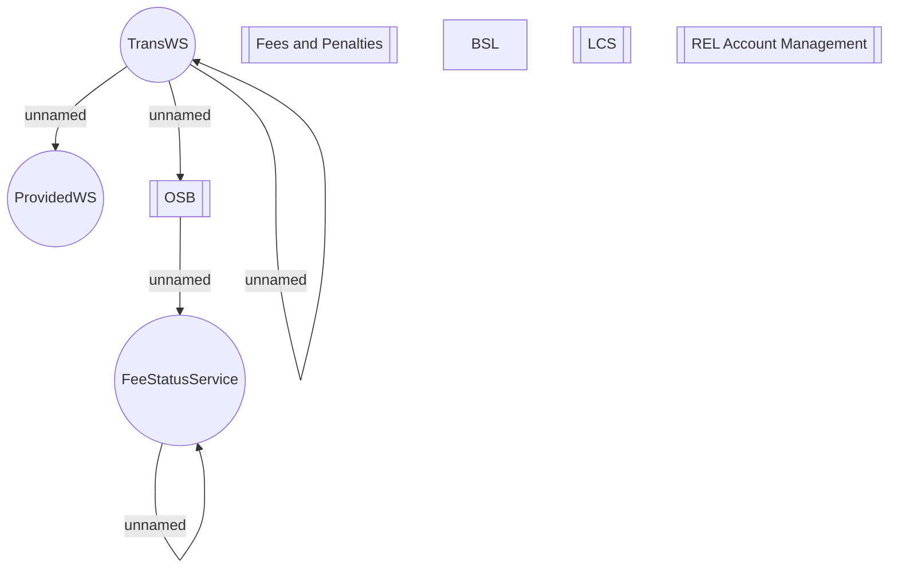

# Charging & Canceling fees component integration

- **Diagram Type**: Component
- **Package**: HomerSelect/BSL/Analysis Model/Installment Schedule/Fees and Penalties/Charging request/Component model
- **Diagram ID**: 159986
- **Elements**: 13
- **Connectors**: 6

