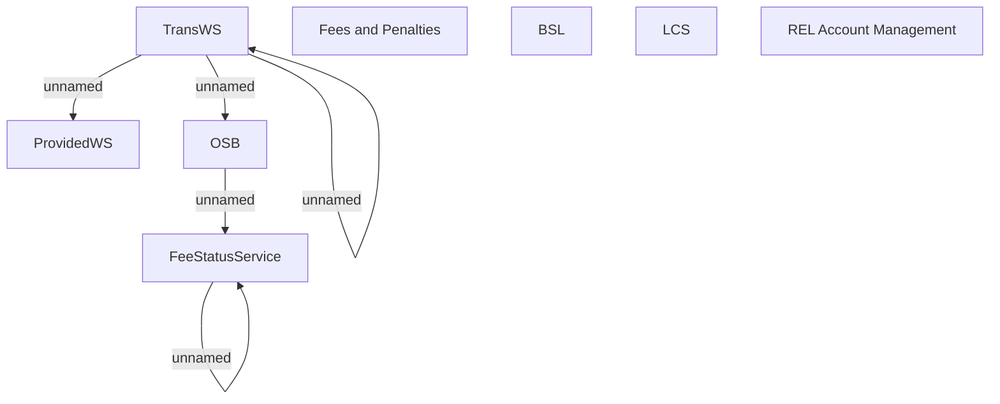

# Charging & Canceling fees component integration

```mermaid
graph TD
    TransWS["TransWS"]
    FeeStatusService["FeeStatusService"]
    FeeStatusService["FeeStatusService"]
    ProvidedWS["ProvidedWS"]
    FeeStatusService["FeeStatusService"]
    TransWS["TransWS"]
    FeeStatusService["FeeStatusService"]
    TransWS["TransWS"]
    OSB["OSB"]
    Fees_Penalties["Fees and Penalties"]
    BSL["BSL"]
    LCS["LCS"]
    REL_Account_Management["REL Account Management"]
    TransWS -->|unnamed| ProvidedWS
    TransWS -->|unnamed| TransWS
    OSB -->|unnamed| FeeStatusService
    TransWS -->|unnamed| OSB
    FeeStatusService -->|unnamed| FeeStatusService
    FeeStatusService -->|unnamed| FeeStatusService
```
