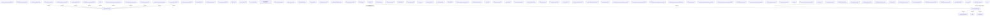

# BSL interfaces overview

```mermaid
graph TD
    CELAccountTransactionsRequest["CELAccountTransactionsRequest"]
    InsuranceTransactionRequest["InsuranceTransactionRequest"]
    PairPaymentBatchRequest["PairPaymentBatchRequest"]
    RefundPaymentRequest["RefundPaymentRequest"]
    DisbursementConfirmationRequest["DisbursementConfirmationRequest"]
    IncomingPaymentRequest["IncomingPaymentRequest"]
    ADD_FingerprintIdentificationStatusNotification["{ADD}FingerprintIdentificationStatusNotification"]
    Event["Event"]
    CreditLimitChangeResultRequest["CreditLimitChangeResultRequest"]
    SaleContractResponse["SaleContractResponse"]
    ApprovalProcessResult["ApprovalProcessResult"]
    AccountBalanceChangeRequest["AccountBalanceChangeRequest"]
    ContractCreditAccountRequest["ContractCreditAccountRequest"]
    LoanServiceRequestRequest["LoanServiceRequestRequest"]
    DDSInfoRequest["DDSInfoRequest"]
    ContractFullInfoRequest["ContractFullInfoRequest"]
    ApprovalProcessRequest["ApprovalProcessRequest"]
    BSL_SNM["BSL : SNM"]
    BSL_Payments["BSL : Payments"]
    BSL_Debt_Catalog["BSL : Debt Catalog"]
    BSL_Contract_Management["BSL : Contract Management"]
    BSL_Contact_origination["BSL : Contact origination"]
    BSL_Product_catalog["BSL :Product catalog"]
    GeneratedMessages["GeneratedMessages"]
    ConsumedMessages["ConsumedMessages"]
    OnlineDebtWS["OnlineDebtWS"]
    DebtNotificationService["DebtNotificationService"]
    DebtCatalogManagementWS["DebtCatalogManagementWS"]
    Debt_Catalog["Debt Catalog"]
    GeneratedMessages["GeneratedMessages"]
    ConsumedMessages["ConsumedMessages"]
    PaymentManagementWS["PaymentManagementWS"]
    PaymentsWS["PaymentsWS"]
    Payments["Payments"]
    SalesNetworkWS["SalesNetworkWS"]
    ProvideSnmDataWS["ProvideSnmDataWS"]
    NotificationWS["NotificationWS"]
    SnmNotificationWS["SnmNotificationWS"]
    SNM["SNM"]
    REST_API["REST API"]
    Product_catalog_PRC["Product catalog (PRC)"]
    External_Reference["External Reference"]
    External_Reference["External Reference"]
    ContractStatusWS["ContractStatusWS"]
    ConsumedMessages["ConsumedMessages"]
    GeneratedMessages["GeneratedMessages"]
    AccountWS["AccountWS"]
    StatementManagementWebService["StatementManagementWebService"]
    RegistryServiceCacheWS["RegistryServiceCacheWS"]
    HistoryWS["HistoryWS"]
    CardManagementWS["CardManagementWS"]
    AccountUIWS["AccountUIWS"]
    AccountTransactionWS["AccountTransactionWS"]
    AccountManagementWS["AccountManagementWS"]
    InstalmentPlanWS["InstalmentPlanWS"]
    LoyaltyManagementWS["LoyaltyManagementWS"]
    FeeStatusService["FeeStatusService"]
    RoleSynchronizationService["RoleSynchronizationService"]
    ContractPropertyServiceService["ContractPropertyServiceService"]
    ContractFeesService["ContractFeesService"]
    ResultAutomaticImportIncomingPaymentsWS["ResultAutomaticImportIncomingPaymentsWS"]
    ResultAutomaticImportDDStatementsWS["ResultAutomaticImportDDStatementsWS"]
    ResultAutomaticImportDDMConfirmationWS["ResultAutomaticImportDDMConfirmationWS"]
    ResultAutomaticImportDDConfirmationsWS["ResultAutomaticImportDDConfirmationsWS"]
    CommunicationWS["CommunicationWS"]
    ResultAutomaticCommunicationListImportWS["ResultAutomaticCommunicationListImportWS"]
    AutomaticChargingRequestsImportResultWS["AutomaticChargingRequestsImportResultWS"]
    AcknowledgementService["AcknowledgementService"]
    AutomaticChargingRequestsImportWS["AutomaticChargingRequestsImportWS"]
    ContractBusinessEventWS["ContractBusinessEventWS"]
    InstallmentScheduleWS["InstallmentScheduleWS"]
    TransWS["TransWS"]
    AutomaticCommunicationListImportWS["AutomaticCommunicationListImportWS"]
    ContractWS["ContractWS"]
    DwhNotificationService["DwhNotificationService"]
    CustomerNotificationWS["CustomerNotificationWS"]
    AccountNotificationWS["AccountNotificationWS"]
    TerminationStatusService["TerminationStatusService"]
    AccountManagementWS["AccountManagementWS"]
    Contract_Management["Contract Management"]
    External_Reference["External Reference"]
    External_Reference["External Reference"]
    ConsumedMessages["ConsumedMessages"]
    GeneratedMessages["GeneratedMessages"]
    ResultOfImportOfferLimitsWS["ResultOfImportOfferLimitsWS"]
    CustomerWS["CustomerWS"]
    FinancialPartnershipService["FinancialPartnershipService"]
    CommodityValidationWS["CommodityValidationWS"]
    SearchContractsWithOTPVerifWS["SearchContractsWithOTPVerifWS"]
    ApplicationManagementWS["ApplicationManagementWS"]
    ProductOfferLimitWS["ProductOfferLimitWS"]
    CabinetWS["CabinetWS"]
    AccountTransactionWS["AccountTransactionWS"]
    AccountManagementWS["AccountManagementWS"]
    AccountNotificationWS["AccountNotificationWS"]
    Application_origination["Application origination"]
    BSL["BSL"]
    ApprovalProcessResult -->|unnamed| ConsumedMessages
    ContractCreditAccountRequest -->|unnamed| ConsumedMessages
    SaleContractResponse -->|unnamed| ConsumedMessages
    CreditLimitChangeResultRequest -->|unnamed| ConsumedMessages
    Event -->|unnamed| ConsumedMessages
    Application_origination -->|Insurance| Contract_Management
    Payments -->|Pair Payment; Unpair Payment| Contract_Management
    Contract_Management -->|unnamed| Product_catalog_PRC
    Application_origination -->|unnamed| Contract_Management
    Contract_Management -->|unnamed| SNM
    ADD_FingerprintIdentificationStatusNotification -->|unnamed| ConsumedMessages
    AccountBalanceChangeRequest -->|unnamed| ConsumedMessages
    Contract_Management -->|unnamed| Debt_Catalog
    IncomingPaymentRequest -->|unnamed| ConsumedMessages
    DisbursementConfirmationRequest -->|unnamed| ConsumedMessages
    RefundPaymentRequest -->|unnamed| ConsumedMessages
    Application_origination -->|Contract signature| Contract_Management
```
