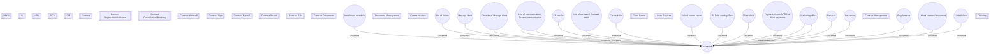

# CLM

- **Diagram Type**: Component
- **Package**: HomerSelect/BSL/Architecture Model/CLM
- **Diagram ID**: 127592
- **Elements**: 57
- **Connectors**: 20

```mermaid
graph TD
    unnamed(("unnamed"))
    PAYM[["PAYM"]]
    unnamed(("unnamed"))
    IS[["IS"]]
    unnamed(("unnamed"))
    LOR[["LOR"]]
    unnamed(("unnamed"))
    RCM[["RCM"]]
    unnamed(("unnamed"))
    CIF[["CIF"]]
    Contract[["Contract"]]
    Contract_Registration_Activation[["Contract Registration/Activation"]]
    Contract_Cancellation_Finishing[["Contract Cancellation/Finishing"]]
    Contract_Write_off[["Contract Write-off"]]
    Contract_Sign[["Contract Sign"]]
    Contract_Pay_off[["Contract Pay-off"]]
    Contract_Search[["Contract Search"]]
    Contract_Sale[["Contract Sale"]]
    Contract_Documents[["Contract Documents"]]
    unnamed(("unnamed"))
    Supplements[["Supplements"]]
    Document_Management[["Document Management"]]
    unnamed(("unnamed"))
    unnamed(("unnamed"))
    Communication[["Communication"]]
    unnamed(("unnamed"))
    unnamed(("unnamed"))
    Installment_schedule(("Installment schedule"))
    Marketing_offers(("Marketing offers"))
    List_of_contracts_Contract_detail(("List of contracts/ Contract detail"))
    CB_results(("CB results"))
    List_of_communication_Create_communication(("List of communication/ Create communication"))
    Client_data_Manage_client(("Client data/ Manage client"))
    List_of_tickets(("List of tickets"))
    Client_Center[["Client Center"]]
    unnamed(("unnamed"))
    Loan_Services[["Loan Services"]]
    unnamed(("unnamed"))
    Insurance[["Insurance"]]
    unnamed(("unnamed"))
    Create_ticket(("Create ticket"))
    Supplements(("Supplements"))
    Marketing_offers(("Marketing offers"))
    Insurance(("Insurance"))
    Services(("Services"))
    Payment_channels_DDM_Block_payments(("Payment channels/ DDM/ Block payments"))
    IS_Debt_catalog_Fees(("IS/ Debt catalog/ Fees"))
    Manage_client(("Manage client"))
    Client_detail(("Client detail"))
    List_of_communication_Create_communication(("List of communication/ Create communication"))
    unnamed(("unnamed"))
    Contract_Management[["Contract Management"]]
    Linked_comm_record(("Linked comm. record"))
    Linked_client(("Linked client"))
    Linked_contract_document(("Linked contract/ document"))
    unnamed(("unnamed"))
    Ticketing[["Ticketing"]]
    Installment_schedule -->|unnamed| unnamed
    List_of_tickets -->|unnamed| unnamed
    Manage_client -->|unnamed| unnamed
    Client_data_Manage_client -->|unnamed| unnamed
    List_of_communication_Create_communication -->|unnamed| unnamed
    List_of_communication_Create_communication -->|unnamed| unnamed
    CB_results -->|unnamed| unnamed
    List_of_contracts_Contract_detail -->|unnamed| unnamed
    Create_ticket -->|unnamed| unnamed
    Marketing_offers -->|unnamed| unnamed
    Linked_comm_record -->|unnamed| unnamed
    IS_Debt_catalog_Fees -->|unnamed| unnamed
    Client_detail -->|unnamed| unnamed
    Payment_channels_DDM_Block_payments -->|unnamed| unnamed
    Services -->|unnamed| unnamed
    Insurance -->|unnamed| unnamed
    Supplements -->|unnamed| unnamed
    Linked_contract_document -->|unnamed| unnamed
    Linked_client -->|unnamed| unnamed
    Marketing_offers -->|unnamed| unnamed
```
