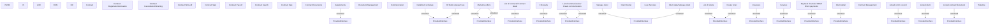

# CLM

```mermaid
graph TD
    el_1518951["ProvidedInterface"]
    PAYM["PAYM"]
    el_1518978["ProvidedInterface"]
    IS["IS"]
    el_1518960["ProvidedInterface"]
    LOR["LOR"]
    el_1518985["ProvidedInterface"]
    RCM["RCM"]
    el_1518979["ProvidedInterface"]
    CIF["CIF"]
    Contract["Contract"]
    Contract_Registration_Activation["Contract Registration/Activation"]
    Contract_Cancellation_Finishing["Contract Cancellation/Finishing"]
    Contract_Write_off["Contract Write-off"]
    Contract_Sign["Contract Sign"]
    Contract_Pay_off["Contract Pay-off"]
    Contract_Search["Contract Search"]
    Contract_Sale["Contract Sale"]
    Contract_Documents["Contract Documents"]
    el_1518972["ProvidedInterface"]
    Supplements["Supplements"]
    Document_Management["Document Management"]
    el_1518968["ProvidedInterface"]
    el_1518976["ProvidedInterface"]
    Communication["Communication"]
    el_1518963["ProvidedInterface"]
    el_1518956["ProvidedInterface"]
    Installment_schedule["Installment schedule"]
    Marketing_offers["Marketing offers"]
    List_of_contracts_Contract_detail["List of contracts/ Contract detail"]
    CB_results["CB results"]
    List_of_communication_Create_communication["List of communication/ Create communication"]
    Client_data_Manage_client["Client data/ Manage client"]
    List_of_tickets["List of tickets"]
    Client_Center["Client Center"]
    el_1518983["ProvidedInterface"]
    Loan_Services["Loan Services"]
    el_1518959["ProvidedInterface"]
    Insurance["Insurance"]
    el_1518969["ProvidedInterface"]
    Create_ticket["Create ticket"]
    Supplements["Supplements"]
    Marketing_offers["Marketing offers"]
    Insurance["Insurance"]
    Services["Services"]
    Payment_channels_DDM_Block_payments["Payment channels/ DDM/ Block payments"]
    IS_Debt_catalog_Fees["IS/ Debt catalog/ Fees"]
    Manage_client["Manage client"]
    Client_detail["Client detail"]
    List_of_communication_Create_communication["List of communication/ Create communication"]
    el_1518958["ProvidedInterface"]
    Contract_Management["Contract Management"]
    Linked_comm_record["Linked comm. record"]
    Linked_client["Linked client"]
    Linked_contract_document["Linked contract/ document"]
    el_1518982["ProvidedInterface"]
    Ticketing["Ticketing"]
    Installment_schedule -->|unnamed| el_1518978
    List_of_tickets -->|unnamed| el_1518982
    Manage_client -->|unnamed| el_1518979
    Client_data_Manage_client -->|unnamed| el_1518979
    List_of_communication_Create_communication -->|unnamed| el_1518976
    List_of_communication_Create_communication -->|unnamed| el_1518976
    CB_results -->|unnamed| el_1518985
    List_of_contracts_Contract_detail -->|unnamed| el_1518958
    Create_ticket -->|unnamed| el_1518982
    Marketing_offers -->|unnamed| el_1518960
    Linked_comm_record -->|unnamed| el_1518968
    IS_Debt_catalog_Fees -->|unnamed| el_1518978
    Client_detail -->|unnamed| el_1518956
    Payment_channels_DDM_Block_payments -->|unnamed| el_1518951
    Services -->|unnamed| el_1518983
    Insurance -->|unnamed| el_1518959
    Supplements -->|unnamed| el_1518972
    Linked_contract_document -->|unnamed| el_1518969
    Linked_client -->|unnamed| el_1518963
    Marketing_offers -->|unnamed| el_1518960
```
