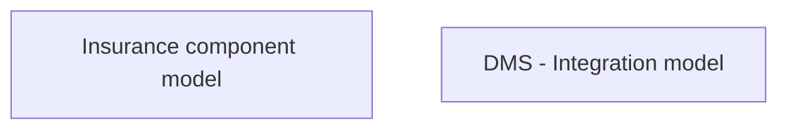

# CSI

- **Diagram Type**: Component
- **Package**: HomerSelect/BSL/Architecture Model/CSI
- **Diagram ID**: 136895
- **Elements**: 2
- **Connectors**: 0

```mermaid
graph TD
    Insurance_component_model["Insurance component model"]
    DMS_Integration_model["DMS - Integration model"]
```
