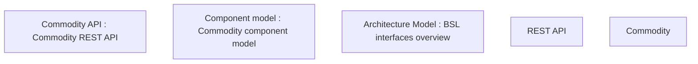

# Commodity

```mermaid
graph TD
    Commodity_API_Commodity_REST_API["Commodity API : Commodity REST API"]
    Component_model_Commodity_component_model["Component model : Commodity component model"]
    Architecture_Model_BSL_interfaces_overview["Architecture Model : BSL interfaces overview"]
    REST_API["REST API"]
    Commodity["Commodity"]
```
