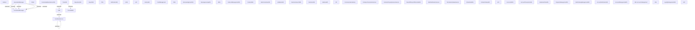

# Component list

```mermaid
graph TD
    Cabinet["Cabinet"]
    GeneratedMessages["GeneratedMessages"]
    ConsumedMessages["ConsumedMessages"]
    CBSA["CBSA"]
    GeneratedMessages["GeneratedMessages"]
    ConsumedMessages["ConsumedMessages"]
    CommodityManufacturerWS["CommodityManufacturerWS"]
    TransWS["TransWS"]
    FeeStatusService["FeeStatusService"]
    OSB["OSB"]
    RepositoryWS["RepositoryWS"]
    ReportWS["ReportWS"]
    PSS["PSS"]
    NotificationWS["NotificationWS"]
    HSIS["HSIS"]
    LAP["LAP"]
    HistoryWS["HistoryWS"]
    CardManagement["CardManagement"]
    CMS["CMS"]
    AcknowledgementWS["AcknowledgementWS"]
    NotificationWS["NotificationWS"]
    MessageLookupWS["MessageLookupWS"]
    MSS["MSS"]
    CodeListManagementWS["CodeListManagementWS"]
    CodeListWS["CodeListWS"]
    BatchCustomerWS["BatchCustomerWS"]
    HistoryWS["HistoryWS"]
    ValidationWS["ValidationWS"]
    CustomerSearchWS["CustomerSearchWS"]
    CustomerWS["CustomerWS"]
    AddressWS["AddressWS"]
    CIF["CIF"]
    ConsumedMessages["ConsumedMessages"]
    GeneratedMessages["GeneratedMessages"]
    CommunicationHistory["CommunicationHistory"]
    RoleSynchronizationService["RoleSynchronizationService"]
    ContractPropertyServiceService["ContractPropertyServiceService"]
    ResultOfImportOfferLimitsWS["ResultOfImportOfferLimitsWS"]
    TransWS["TransWS"]
    DebtNotificationService["DebtNotificationService"]
    FeeStatusService["FeeStatusService"]
    TerminationStatusService["TerminationStatusService"]
    OnlineDebtWS["OnlineDebtWS"]
    ContractStatusWS["ContractStatusWS"]
    LCS["LCS"]
    ConsumedMessages["ConsumedMessages"]
    GeneratedMessages["GeneratedMessages"]
    AccountUIWS["AccountUIWS"]
    AccountTransactionWS["AccountTransactionWS"]
    InstalmentPlanWS["InstalmentPlanWS"]
    FeeStatusService["FeeStatusService"]
    ProvidedWS["ProvidedWS"]
    PaymentManagementWS["PaymentManagementWS"]
    DebtCatalogManagementWS["DebtCatalogManagementWS"]
    AccountNotificationWS["AccountNotificationWS"]
    AccountManagementWS["AccountManagementWS"]
    REL_Account_Management["REL Account Management"]
    BSL["BSL"]
    LoyaltyManagementWS["LoyaltyManagementWS"]
    LRP["LRP"]
    FeeStatusService -->|unnamed| FeeStatusService
    TransWS -->|unnamed| ProvidedWS
    OSB -->|unnamed| FeeStatusService
    GeneratedMessages -->|unnamed| ConsumedMessages
    GeneratedMessages -->|unnamed| ConsumedMessages
    TransWS -->|unnamed| OSB
    GeneratedMessages -->|unnamed| ConsumedMessages
    GeneratedMessages -->|unnamed| ConsumedMessages
    GeneratedMessages -->|unnamed| ConsumedMessages
```
