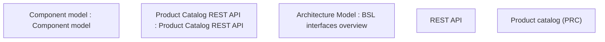

# Product catalog

```mermaid
graph TD
    Component_model_Component_model["Component model : Component model"]
    Product_Catalog_REST_API_Product_Catalog_REST_API["Product Catalog REST API : Product Catalog REST API"]
    Architecture_Model_BSL_interfaces_overview["Architecture Model : BSL interfaces overview"]
    REST_API["REST API"]
    Product_catalog_PRC["Product catalog (PRC)"]
```
