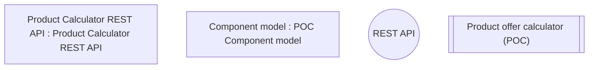

# Product offer calculator

- **Diagram Type**: Component
- **Package**: HomerSelect/BSL/Architecture Model/Component list
- **Diagram ID**: 161220
- **Elements**: 4
- **Connectors**: 0

```mermaid
graph TD
    Product_Calculator_REST_API_Product_Calculator_REST_API["Product Calculator REST API : Product Calculator REST API"]
    Component_model_POC_Component_model["Component model : POC Component model"]
    REST_API(("REST API"))
    Product_offer_calculator_POC[["Product offer calculator (POC)"]]
```
