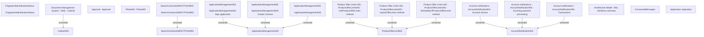

# Contact origination

```mermaid
graph TD
    FingerprintIdentificationStatus_FingerprintIdentificationSta["FingerprintIdentificationStatus : FingerprintIdentificationStatus"]
    Document_Management_System_DMS_Cabinet["Document Management System : DMS - Cabinet"]
    Approval_Approval["Approval : Approval"]
    PhotoWS_PhotoWS["PhotoWS : PhotoWS"]
    SearchContractsWithOTPVerifWS_SearchContractsWithOTPVerifWS["SearchContractsWithOTPVerifWS : SearchContractsWithOTPVerifWS"]
    ApplicationManagementWS_ApplicationManagementWS_Sign_applica["ApplicationManagementWS : ApplicationManagementWS-Sign application"]
    ApplicationManagementWS_ApplicationManagementWS_Create_Contr["ApplicationManagementWS : ApplicationManagementWS-Create Contract"]
    ApplicationManagementWS_ApplicationManagementWS["ApplicationManagementWS : ApplicationManagementWS"]
    Product_Offer_Limits_WS_ProductOfferLimitsWS_SetValidityOfPr["Product Offer Limits WS : ProductOfferLimitsWS - SetValidityOfProductOfferLimits method"]
    Product_Offer_Limits_WS_ProductOfferLimitsWS_ImportOfferLimi["Product Offer Limits WS : ProductOfferLimitsWS - ImportOfferLimits method"]
    Product_Offer_Limits_WS_ProductOfferLimitsWS_GetProductOffer["Product Offer Limits WS : ProductOfferLimitsWS - GetProductOfferLimits method"]
    Account_notifications_AccountNotificationWS_Transactions["Account notifications : AccountNotificationWS - Transactions"]
    Account_notifications_AccountNotificationWS_Incoming_payment["Account notifications : AccountNotificationWS - Incoming payment processing"]
    Account_notifications_AccountNotificationWS_Account_closure["Account notifications : AccountNotificationWS - Account closure"]
    Architecture_Model_BSL_interfaces_overview["Architecture Model : BSL interfaces overview"]
    CabinetWS["CabinetWS"]
    ConsumedMessages["ConsumedMessages"]
    SearchContractsWithOTPVerifWS["SearchContractsWithOTPVerifWS"]
    ProductOfferLimitWS["ProductOfferLimitWS"]
    ApplicationManagementWS["ApplicationManagementWS"]
    AccountNotificationWS["AccountNotificationWS"]
    Application_origination["Application origination"]
    Account_notifications_AccountNotificationWS_Account_closure -->|unnamed| AccountNotificationWS
    Account_notifications_AccountNotificationWS_Incoming_payment -->|unnamed| AccountNotificationWS
    Account_notifications_AccountNotificationWS_Transactions -->|unnamed| AccountNotificationWS
    ApplicationManagementWS_ApplicationManagementWS_Sign_applica -->|unnamed| ApplicationManagementWS
    ApplicationManagementWS_ApplicationManagementWS_Create_Contr -->|unnamed| ApplicationManagementWS
    ApplicationManagementWS_ApplicationManagementWS -->|unnamed| ApplicationManagementWS
    Product_Offer_Limits_WS_ProductOfferLimitsWS_GetProductOffer -->|unnamed| ProductOfferLimitWS
    Product_Offer_Limits_WS_ProductOfferLimitsWS_ImportOfferLimi -->|unnamed| ProductOfferLimitWS
    Product_Offer_Limits_WS_ProductOfferLimitsWS_SetValidityOfPr -->|unnamed| ProductOfferLimitWS
    SearchContractsWithOTPVerifWS_SearchContractsWithOTPVerifWS -->|unnamed| SearchContractsWithOTPVerifWS
    Document_Management_System_DMS_Cabinet -->|unnamed| CabinetWS
```
