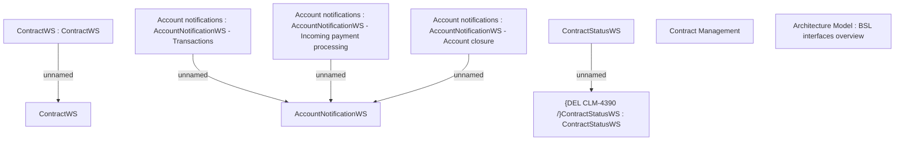

# Contract Management

```mermaid
graph TD
    DEL_CLM_4390_ContractStatusWS_ContractStatusWS["{DEL CLM-4390 /}ContractStatusWS : ContractStatusWS"]
    ContractWS_ContractWS["ContractWS : ContractWS"]
    Account_notifications_AccountNotificationWS_Transactions["Account notifications : AccountNotificationWS - Transactions"]
    Account_notifications_AccountNotificationWS_Incoming_payment["Account notifications : AccountNotificationWS - Incoming payment processing"]
    Account_notifications_AccountNotificationWS_Account_closure["Account notifications : AccountNotificationWS - Account closure"]
    ContractStatusWS["ContractStatusWS"]
    ContractWS["ContractWS"]
    AccountNotificationWS["AccountNotificationWS"]
    Contract_Management["Contract Management"]
    Architecture_Model_BSL_interfaces_overview["Architecture Model : BSL interfaces overview"]
    Account_notifications_AccountNotificationWS_Transactions -->|unnamed| AccountNotificationWS
    Account_notifications_AccountNotificationWS_Incoming_payment -->|unnamed| AccountNotificationWS
    Account_notifications_AccountNotificationWS_Account_closure -->|unnamed| AccountNotificationWS
    ContractWS_ContractWS -->|unnamed| ContractWS
    ContractStatusWS -->|unnamed| DEL_CLM_4390_ContractStatusWS_ContractStatusWS
```
