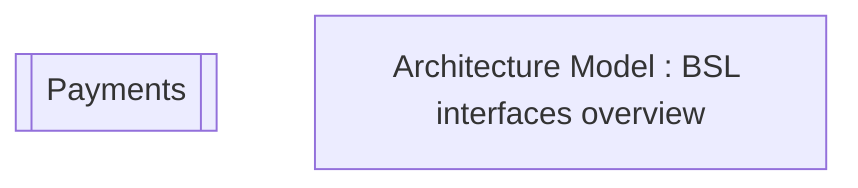

# Payments

- **Diagram Type**: Component
- **Package**: HomerSelect/BSL/Architecture Model/Component list/BSL
- **Diagram ID**: 161224
- **Elements**: 2
- **Connectors**: 0

```mermaid
graph TD
    Payments[["Payments"]]
    Architecture_Model_BSL_interfaces_overview["Architecture Model : BSL interfaces overview"]
```
