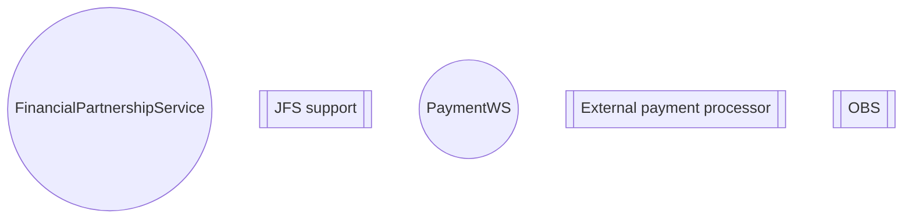

# Country specific components

- **Diagram Type**: Component
- **Package**: HomerSelect/BSL/Architecture Model/Component list/Country specific components
- **Diagram ID**: 103293
- **Elements**: 5
- **Connectors**: 0

