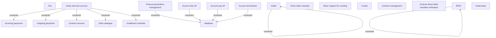

# Architecture

```mermaid
graph TD
    el_1798787["Text"]
    Incoming_payments["Incoming payments"]
    Outgoing_payments["Outgoing payments"]
    Contract_services["Contract services"]
    Debt_catalogue["Debt catalogue"]
    Installment_schedule["Installment schedule"]
    Finance_parameters_management["Finance parameters management"]
    database["database"]
    Acount_write_off["Acount write-off"]
    Account_pay_off["Account pay-off"]
    Account_termination["Account termination"]
    Kafka["Kafka"]
    REST["REST"]
    Direct_debit_mandate["Direct debit mandate"]
    Basic_Support_for_Lending["Basic Support for Lending"]
    REST["REST"]
    Truslist["Truslist"]
    Kafka["Kafka"]
    REST["REST"]
    Contract_management["Contract management"]
    Kafka["Kafka"]
    REST["REST"]
    Contract_direct_debit_mandate_verification["Contract direct debit mandate verification"]
    Close_end_loan_account["Close-end loan account"]
    Kubernetes["Kubernetes"]
    Finance_parameters_management -->|unnamed| database
    Acount_write_off -->|unnamed| database
    Account_pay_off -->|unnamed| database
    Account_termination -->|unnamed| database
    Close_end_loan_account -->|unnamed| Installment_schedule
    Close_end_loan_account -->|unnamed| Debt_catalogue
    Close_end_loan_account -->|unnamed| Contract_services
    Close_end_loan_account -->|unnamed| Outgoing_payments
    Close_end_loan_account -->|unnamed| Incoming_payments
    REST -->|unnamed| REST
    REST -->|unnamed| REST
    REST -->|unnamed| REST
    Kafka -->|unnamed| Kafka
    Kafka -->|unnamed| Kafka
```
