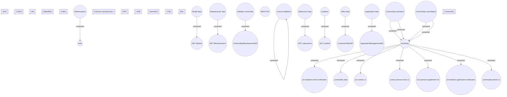

# Commodity component model

- **Diagram Type**: Component
- **Package**: HomerSelect/BSL/Modules/Commodity/Component model
- **Diagram ID**: 160976
- **Elements**: 53
- **Connectors**: 20

```mermaid
graph TD
    auth(("auth"))
    SSO[["SSO"]]
    coma_contract_event_v1(("coma.contract.event.v1"))
    COMA[["COMA"]]
    am_headers_event_notification(("am.headers.event.notification"))
    AM[["AM"]]
    unnamed(("unnamed"))
    unnamed(("unnamed"))
    unnamed(("unnamed"))
    unnamed(("unnamed"))
    unnamed(("unnamed"))
    RabbitMQ[["RabbitMQ"]]
    unnamed(("unnamed"))
    unnamed(("unnamed"))
    unnamed(("unnamed"))
    unnamed(("unnamed"))
    unnamed(("unnamed"))
    unnamed(("unnamed"))
    Kafka[["Kafka"]]
    Cancel_validation(("Cancel validation"))
    External_manufacturers[["External manufacturers"]]
    prc_events_v1(("prc.events.v1"))
    GET_Models(("GET Models"))
    GET_Manufacturers(("GET Manufacturers"))
    PRC[["PRC"]]
    CommodityManufacturertWS(("CommodityManufacturertWS"))
    OSB[["OSB"]]
    GET_salesrooms(("GET salesrooms"))
    HomeSIS[["HomeSIS"]]
    GET_codelist(("GET codelist"))
    CSD[["CSD"]]
    bsl_headers_application_notification(("bsl.headers.application.notification"))
    bsl_contract_supplement_v6(("bsl.contract-supplement.v6"))
    CustomerOfferWS(("CustomerOfferWS"))
    ApplicationManagementWS(("ApplicationManagementWS"))
    BSL[["BSL"]]
    Authorizatiom(("Authorizatiom"))
    Commodity_cancellation(("Commodity cancellation"))
    Commodity_cancellation(("Commodity cancellation"))
    Commodity_activation(("Commodity activation"))
    Commodity_activation(("Commodity activation"))
    commodity_data(("commodity data"))
    commodity_events_v1(("commodity.events.v1"))
    REST_API(("REST API"))
    Cancel_validation(("Cancel validation"))
    Model_data(("Model data"))
    Manufacturer_data(("Manufacturer data"))
    Validate_commodity(("Validate commodity"))
    Salesroom_data(("Salesroom data"))
    codelists(("codelists"))
    Offer_data(("Offer data"))
    Application_data(("Application data"))
    Commodity[["Commodity"]]
    unnamed -->|unnamed| am_headers_event_notification
    Offer_data -->|unnamed| CustomerOfferWS
    codelists -->|unnamed| GET_codelist
    Salesroom_data -->|unnamed| GET_salesrooms
    Validate_commodity -->|unnamed| CommodityManufacturertWS
    Manufacturer_data -->|unnamed| GET_Manufacturers
    Model_data -->|unnamed| GET_Models
    Cancel_validation -->|unnamed| Cancel_validation
    Application_data -->|unnamed| ApplicationManagementWS
    unnamed -->|unnamed| commodity_data
    unnamed -->|unnamed| prc_events_v1
    Commodity_activation -->|unnamed| unnamed
    unnamed -->|unnamed| coma_contract_event_v1
    Commodity_activation -->|unnamed| unnamed
    unnamed -->|unnamed| bsl_contract_supplement_v6
    Commodity_cancellation -->|unnamed| unnamed
    unnamed -->|unnamed| bsl_headers_application_notification
    Commodity_cancellation -->|unnamed| unnamed
    Authorizatiom -->|unnamed| auth
    unnamed -->|unnamed| commodity_events_v1
```
