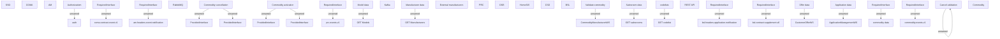

# Commodity component model

```mermaid
graph TD
    auth["auth"]
    SSO["SSO"]
    coma_contract_event_v1["coma.contract.event.v1"]
    COMA["COMA"]
    am_headers_event_notification["am.headers.event.notification"]
    AM["AM"]
    el_1844863["RequiredInterface"]
    el_1844873["ProvidedInterface"]
    el_1844879["ProvidedInterface"]
    el_1844851["RequiredInterface"]
    el_1844860["RequiredInterface"]
    RabbitMQ["RabbitMQ"]
    el_1844880["ProvidedInterface"]
    el_1844868["RequiredInterface"]
    el_1844890["RequiredInterface"]
    el_1844881["ProvidedInterface"]
    el_1844885["RequiredInterface"]
    el_1844861["RequiredInterface"]
    Kafka["Kafka"]
    Cancel_validation["Cancel validation"]
    External_manufacturers["External manufacturers"]
    prc_events_v1["prc.events.v1"]
    GET_Models["GET Models"]
    GET_Manufacturers["GET Manufacturers"]
    PRC["PRC"]
    CommodityManufacturertWS["CommodityManufacturertWS"]
    OSB["OSB"]
    GET_salesrooms["GET salesrooms"]
    HomeSIS["HomeSIS"]
    GET_codelist["GET codelist"]
    CSD["CSD"]
    bsl_headers_application_notification["bsl.headers.application.notification"]
    bsl_contract_supplement_v6["bsl.contract-supplement.v6"]
    CustomerOfferWS["CustomerOfferWS"]
    ApplicationManagementWS["ApplicationManagementWS"]
    BSL["BSL"]
    Authorizatiom["Authorizatiom"]
    Commodity_cancellation["Commodity cancellation"]
    Commodity_cancellation["Commodity cancellation"]
    Commodity_activation["Commodity activation"]
    Commodity_activation["Commodity activation"]
    commodity_data["commodity data"]
    commodity_events_v1["commodity.events.v1"]
    REST_API["REST API"]
    Cancel_validation["Cancel validation"]
    Model_data["Model data"]
    Manufacturer_data["Manufacturer data"]
    Validate_commodity["Validate commodity"]
    Salesroom_data["Salesroom data"]
    codelists["codelists"]
    Offer_data["Offer data"]
    Application_data["Application data"]
    Commodity["Commodity"]
    el_1844851 -->|unnamed| am_headers_event_notification
    Offer_data -->|unnamed| CustomerOfferWS
    codelists -->|unnamed| GET_codelist
    Salesroom_data -->|unnamed| GET_salesrooms
    Validate_commodity -->|unnamed| CommodityManufacturertWS
    Manufacturer_data -->|unnamed| GET_Manufacturers
    Model_data -->|unnamed| GET_Models
    Cancel_validation -->|unnamed| Cancel_validation
    Application_data -->|unnamed| ApplicationManagementWS
    el_1844861 -->|unnamed| commodity_data
    el_1844863 -->|unnamed| prc_events_v1
    Commodity_activation -->|unnamed| el_1844879
    el_1844885 -->|unnamed| coma_contract_event_v1
    Commodity_activation -->|unnamed| el_1844881
    el_1844890 -->|unnamed| bsl_contract_supplement_v6
    Commodity_cancellation -->|unnamed| el_1844873
    el_1844868 -->|unnamed| bsl_headers_application_notification
    Commodity_cancellation -->|unnamed| el_1844880
    Authorizatiom -->|unnamed| auth
    el_1844860 -->|unnamed| commodity_events_v1
```
