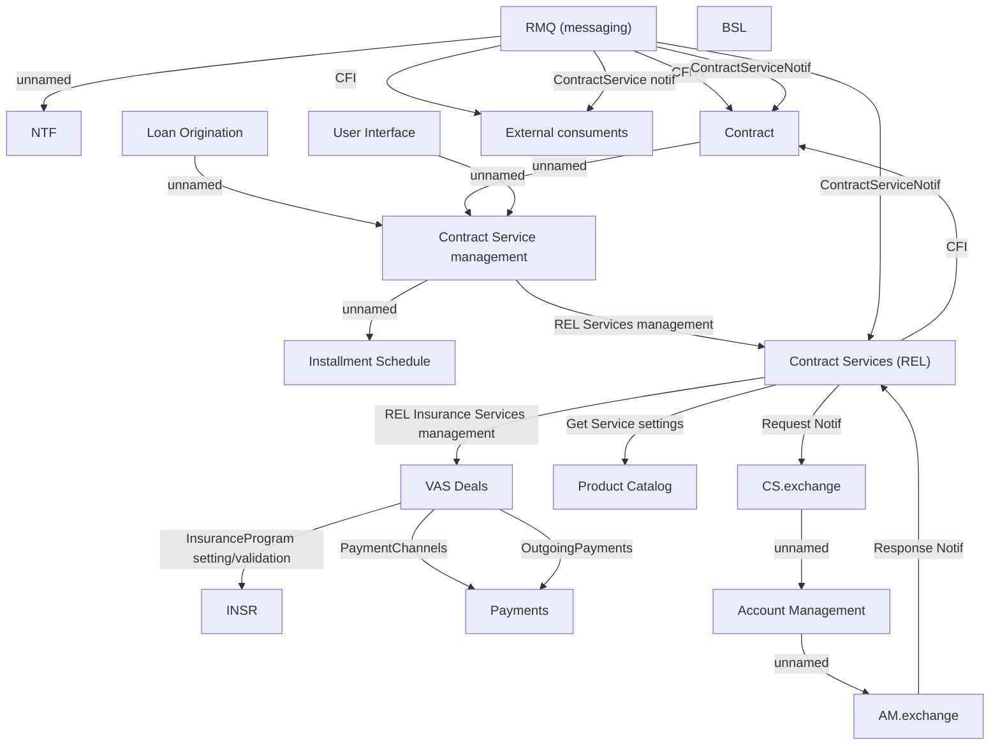

# BSL integration proposal - impacted components

```mermaid
graph TD
    NTF["NTF"]
    INSR["INSR"]
    Payments["Payments"]
    Contract["Contract"]
    Loan_Origination["Loan Origination"]
    External_consuments["External consuments"]
    RMQ_messaging["RMQ (messaging)"]
    Installment_Schedule["Installment Schedule"]
    User_Interface["User Interface"]
    VAS_Deals["VAS Deals"]
    Product_Catalog["Product Catalog"]
    CS_exchange["CS.exchange"]
    AM_exchange["AM.exchange"]
    RMQ_messaging["RMQ (messaging)"]
    Account_Management["Account Management"]
    Contract_Service_management["Contract Service management"]
    BSL["BSL"]
    Contract_Services_REL["Contract Services (REL)"]
    Contract_Services_REL -->|Get Service settings| Product_Catalog
    VAS_Deals -->|InsuranceProgram setting/validation| INSR
    VAS_Deals -->|PaymentChannels| Payments
    VAS_Deals -->|OutgoingPayments| Payments
    RMQ_messaging -->|CFIv7| Contract
    RMQ_messaging -->|ContractServiceNotif| Contract
    Contract_Services_REL -->|CFI| Contract
    RMQ_messaging -->|CFI| External_consuments
    RMQ_messaging -->|ContractService notif| External_consuments
    RMQ_messaging -->|unnamed| NTF
    Contract_Services_REL -->|REL Insurance Services management| VAS_Deals
    Contract_Service_management -->|REL Services management| Contract_Services_REL
    Contract_Services_REL -->|Request Notif| CS_exchange
    Account_Management -->|unnamed| AM_exchange
    CS_exchange -->|unnamed| Account_Management
    Loan_Origination -->|unnamed| Contract_Service_management
    Contract -->|unnamed| Contract_Service_management
    User_Interface -->|unnamed| Contract_Service_management
    AM_exchange -->|Response Notif| Contract_Services_REL
    RMQ_messaging -->|ContractServiceNotif| Contract_Services_REL
    Contract_Service_management -->|unnamed| Installment_Schedule
```
