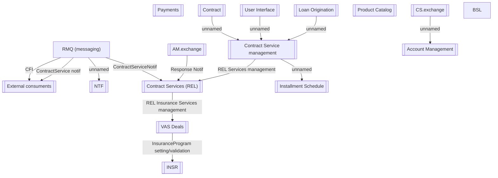

# BSL integration proposal - impacted components

- **Diagram Type**: Component
- **Package**: HomerSelect/BSL/Modules/Contract Services (COS_NG)/BSL integration proposal - Component model
- **Diagram ID**: 160125
- **Elements**: 18
- **Connectors**: 13

