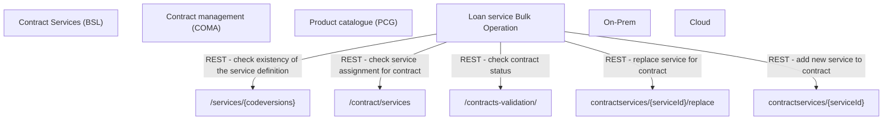

# Component models

```mermaid
graph TD
    contractservices_serviceId["contractservices/{serviceId}"]
    contractservices_serviceId_replace["contractservices/{serviceId}/replace "]
    Contract_Services_BSL["Contract Services (BSL)"]
    contracts_validation["/contracts-validation/ "]
    contract_services["/contract/services"]
    Contract_management_COMA["Contract management (COMA)"]
    services_codeversions["/services/{codeversions}"]
    Product_catalogue_PCG["Product catalogue (PCG)"]
    Loan_service_Bulk_Operation["Loan service Bulk Operation"]
    On_Prem["On-Prem"]
    Cloud["Cloud"]
    Loan_service_Bulk_Operation -->|REST - check existency of the service definition| services_codeversions
    Loan_service_Bulk_Operation -->|REST - check service assignment for contract| contract_services
    Loan_service_Bulk_Operation -->|REST - check contract status| contracts_validation
    Loan_service_Bulk_Operation -->|REST - replace service for contract| contractservices_serviceId_replace
    Loan_service_Bulk_Operation -->|REST - add new service to contract| contractservices_serviceId
```
