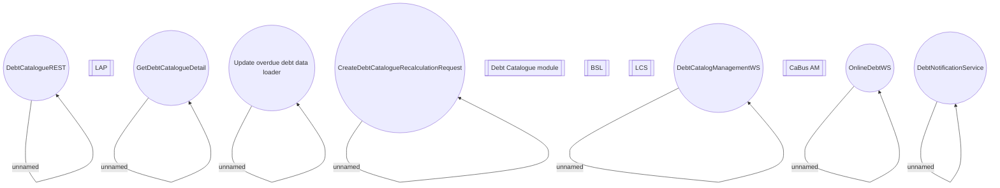

# Debt Catalogue Component Model

- **Diagram Type**: Component
- **Package**: HomerSelect/BSL/Modules/Debt catalogue/Component Model
- **Diagram ID**: 141868
- **Elements**: 21
- **Connectors**: 8

