# DMS Integration model

- **Diagram Type**: Component
- **Package**: HomerSelect/BSL/Modules/Document management (DMS)/Component model
- **Diagram ID**: 162018
- **Elements**: 44
- **Connectors**: 23

```mermaid
graph TD
    GetDocumentTypes(("GetDocumentTypes"))
    FindDocumentsByUuid(("FindDocumentsByUuid"))
    GetContractDocuments(("GetContractDocuments"))
    SetDocumentAttribute(("SetDocumentAttribute"))
    REM[["REM"]]
    AddDocumentToContract(("AddDocumentToContract"))
    CreateContractSuppDocument(("CreateContractSuppDocument"))
    Contract_Supplements[["Contract Supplements"]]
    Component_model_DMS_How_to_get_Document_content["Component model : DMS:How to get Document content"]
    Component_model_DMS_Create_Document_with_content_calling_var["Component model : DMS:Create Document with content - calling variants"]
    GetContractDocuments(("GetContractDocuments"))
    RemoveDocumentFromContract(("RemoveDocumentFromContract"))
    AddDocumentToContract(("AddDocumentToContract"))
    COMA[["COMA"]]
    GetDocumentType(("GetDocumentType"))
    Document_Type[["Document Type"]]
    SettingDocumentProofCheck_v3_ADD_SettingDocumentProofCheck_v["SettingDocumentProofCheck_v3 : {ADD}SettingDocumentProofCheck_v3"]
    SetDocumentFile_v3_ADD_Set_Document_File_v3["SetDocumentFile_v3 : {ADD}Set Document File v3"]
    GetContractDocumentsDetail_v3_ADD_Get_Contract_Documents_det["GetContractDocumentsDetail_v3 : {ADD}Get Contract Documents detail v3"]
    SetDocumentRegistrationCheck(("SetDocumentRegistrationCheck"))
    GetContractDocumentForRegistration(("GetContractDocumentForRegistration"))
    GetContractDocumentList(("GetContractDocumentList"))
    UploadDocumentFile(("UploadDocumentFile"))
    EditDocument(("EditDocument"))
    AddContractDocument(("AddContractDocument"))
    SetDocumentProofCheck(("SetDocumentProofCheck"))
    SetDocumentFile(("SetDocumentFile"))
    GetContractDocument(("GetContractDocument"))
    ContractDocuments[["ContractDocuments"]]
    GetContent(("GetContent"))
    CreateContent(("CreateContent"))
    Cabinet[["Cabinet"]]
    HO_BSL_database["HO_BSL (database)"]
    BSL["BSL"]
    External_system[["External system"]]
    UpdateDocumentAttribute(("UpdateDocumentAttribute"))
    SetDocumentAttribute(("SetDocumentAttribute"))
    DeleteDocumentFile(("DeleteDocumentFile"))
    CreateDocumentFile(("CreateDocumentFile"))
    DeleteDocument(("DeleteDocument"))
    FindDocuments(("FindDocuments"))
    GetDocument(("GetDocument"))
    CreateDocument(("CreateDocument"))
    Document_Instance[["Document Instance"]]
    COMA -->|unnamed| HO_BSL_database
    External_system -->|unnamed| RemoveDocumentFromContract
    External_system -->|unnamed| AddDocumentToContract
    AddDocumentToContract -->|unnamed| AddDocumentToContract
    SettingDocumentProofCheck_v3_ADD_SettingDocumentProofCheck_v -->|unnamed| SetDocumentProofCheck
    SetDocumentFile_v3_ADD_Set_Document_File_v3 -->|unnamed| SetDocumentFile
    GetContractDocumentsDetail_v3_ADD_Get_Contract_Documents_det -->|unnamed| GetContractDocument
    Document_Instance -->|unnamed| GetContent
    Document_Instance -->|unnamed| CreateContent
    GetContractDocuments -->|unnamed| GetContractDocuments
    CreateDocument -->|unnamed| CreateContractSuppDocument
    Document_Type -->|unnamed| HO_BSL_database
    Document_Instance -->|unnamed| HO_BSL_database
    Component_model_DMS_Create_Document_with_content_calling_var -->|unnamed| External_system
    SetDocumentAttribute -->|unnamed| SetDocumentAttribute
    FindDocumentsByUuid -->|unnamed| FindDocuments
    External_system -->|unnamed| GetDocument
    External_system -->|unnamed| CreateDocument
    GetDocumentTypes -->|unnamed| GetDocumentType
    External_system -->|unnamed| CreateContent
    ContractDocuments -->|unnamed| HO_BSL_database
    ContractDocuments -->|unnamed| CreateContent
    ContractDocuments -->|unnamed| GetContent
```

