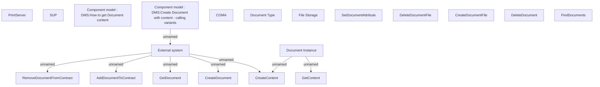

# Integration model

```mermaid
graph TD
    PrintServer["PrintServer"]
    SUP["SUP"]
    Component_model_DMS_How_to_get_Document_content["Component model : DMS:How to get Document content"]
    Component_model_DMS_Create_Document_with_content_calling_var["Component model : DMS:Create Document with content - calling variants"]
    RemoveDocumentFromContract["RemoveDocumentFromContract"]
    AddDocumentToContract["AddDocumentToContract"]
    COMA["COMA"]
    Document_Type["Document Type"]
    GetContent["GetContent"]
    CreateContent["CreateContent"]
    File_Storage["File Storage"]
    External_system["External system"]
    SetDocumentAttribute["SetDocumentAttribute"]
    DeleteDocumentFile["DeleteDocumentFile"]
    CreateDocumentFile["CreateDocumentFile"]
    DeleteDocument["DeleteDocument"]
    FindDocuments["FindDocuments"]
    GetDocument["GetDocument"]
    CreateDocument["CreateDocument"]
    Document_Instance["Document Instance"]
    Document_Instance -->|unnamed| GetContent
    Document_Instance -->|unnamed| CreateContent
    External_system -->|unnamed| RemoveDocumentFromContract
    External_system -->|unnamed| AddDocumentToContract
    External_system -->|unnamed| GetDocument
    External_system -->|unnamed| CreateContent
    External_system -->|unnamed| CreateDocument
    Component_model_DMS_Create_Document_with_content_calling_var -->|unnamed| External_system
```
