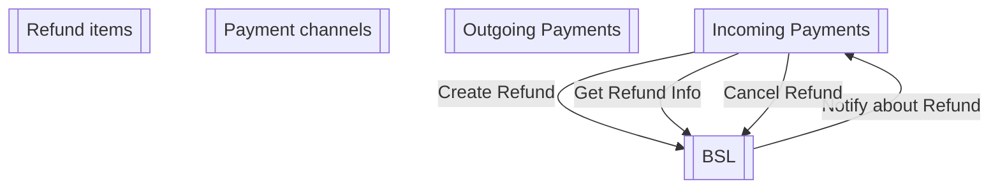

# Component model

- **Diagram Type**: Component
- **Package**: HomerSelect/BSL/Modules/Incoming Payments/Analytical Model/Refunds/Integration model/Component model
- **Diagram ID**: 162744
- **Elements**: 5
- **Connectors**: 4

