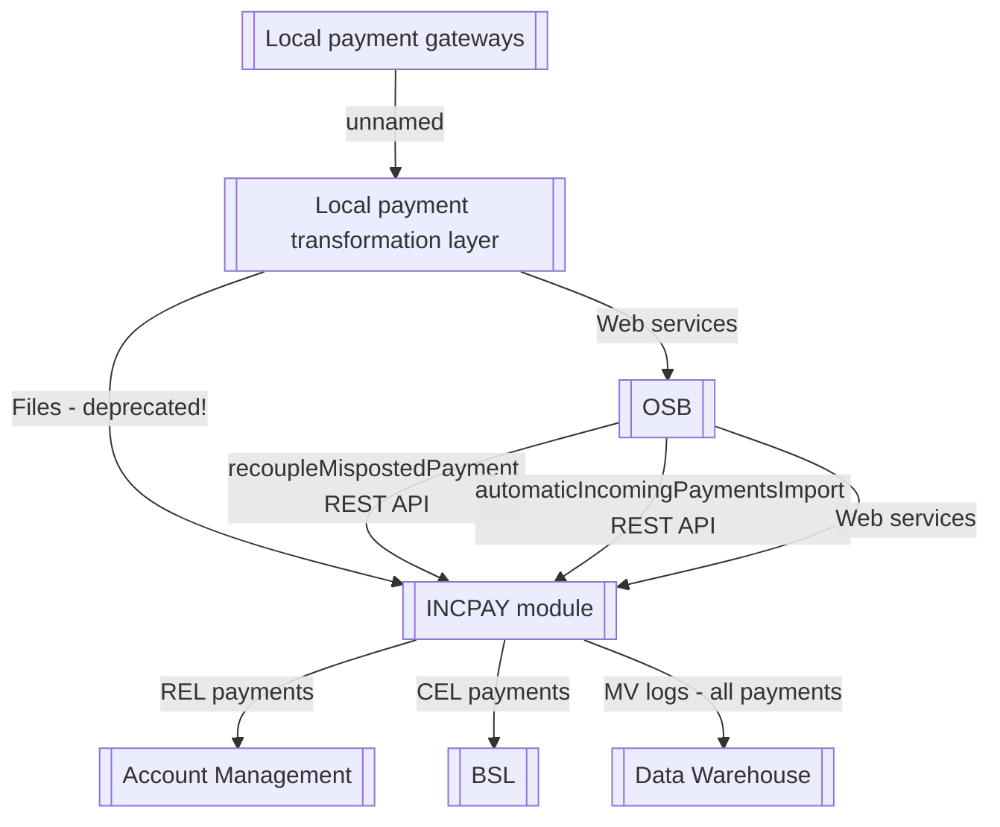

# High level Component model

- **Diagram Type**: Component
- **Package**: HomerSelect/BSL/Modules/Incoming Payments/Interface provided/Interface overiew
- **Diagram ID**: 162740
- **Elements**: 7
- **Connectors**: 9

