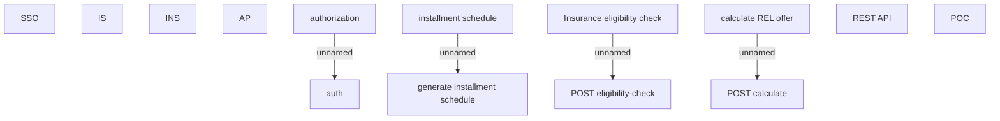

# POC Component model

```mermaid
graph TD
    auth["auth"]
    SSO["SSO"]
    generate_installment_schedule["generate installment schedule"]
    IS["IS"]
    POST_eligibility_check["POST eligibility-check"]
    INS["INS"]
    POST_calculate["POST calculate"]
    AP["AP"]
    authorization["authorization"]
    installment_schedule["installment schedule"]
    Insurance_eligibility_check["Insurance eligibility check"]
    calculate_REL_offer["calculate REL offer"]
    REST_API["REST API"]
    POC["POC"]
    authorization -->|unnamed| auth
    installment_schedule -->|unnamed| generate_installment_schedule
    Insurance_eligibility_check -->|unnamed| POST_eligibility_check
    calculate_REL_offer -->|unnamed| POST_calculate
```
